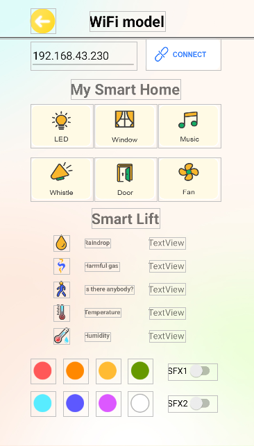

# 11. APP下载和使用说明

## 1\. APP下载安装：

**步骤1：** 在手机/平板浏览器的搜索框中输入官网链接： www.keyes-robot.com


**步骤2：** 找到 “**资料中心**”，并且点击它。


**步骤3：** 在页面找到 “**APP下载**”选项，并且点击它。


**步骤4：** 在 “**APP下载**”页面，找到“**keyes IoT home**”。


**步骤5：** 根据自己的手机/平板系统选择对应的APP下载安装。选择如下：


**安卓系统**

a\. 点击 "**点击下载**" 按钮，下载对应的 "**keyes IoT home.apk**" 文件。


b\. 按照安装提示进行安装。


c\. 下载安装后，单击 打开，出现如下图界面。


选择WIFI。





**苹果系统**

a\. 点击 "**跳转APP Store**" 按钮，跳转到 APP Store 


b\. 在 APP Store 上搜索 **keyes IoT home** ，选择 **keyes IoT home** ，然后点击  获取，下载安装APP即可。


c\. 下载安装后, 单击 打开，出现如下图界面。


选择WIFI


## 2. 实验代码：

⚠️ <span style="color: rgb(255, 76, 65);">**特别提醒：**</span>这里只提供Arduino C 代码，Mixly代码 和 KidsBlock(Scratch)代码等在对应的教程里有提供，请到对应教程中查看，是 **第14课 WiFi控制**。

⚠️ <span style="color: rgb(255, 76, 65);">**特别提醒：**</span> 打开代码文件后，需要修改ESP32开发板需要连接的WiFi名称与密码，您需要分别将 `ChinaNet-2.4G-0DF0` 和 `ChinaNet@233` 替换为您自己的 Wi-Fi 名称和 WiFi 密码。WiFi名称和WiFi密码修改后才能上传代码，否则你的ESP32开发板将无法连接网络。

```c
const char* ssid = "ChinaNet-2.4G-0DF0";  //输入你自己的WiFi名称
const char* pwd = "ChinaNet@233"; //输入你自己的WiFi密码
```

⚠️ **<span style="color: rgb(255, 76, 65);">注意：</span> 请确保代码中的WiFi名称和WiFi密码与连接到您的计算机、手机/平板电脑、ESP32开发板和路由器的网络相同，它们必须在同一局域网（WiFi）内。**

⚠️ **<span style="color: rgb(255, 76, 65);">注意：</span>WiFi必须是2.4Ghz频率的，否则ESP32无法连接WiFi**。

```c
/*
  Keyes
  Read-APP-Characters
  www.keyes-robot.com
*/

#include <Arduino.h>
#ifdef ESP32
#include <WiFi.h>
#elif defined(ESP8266)
#include <ESP8266WiFi.h>
#endif

#include <LiquidCrystal_I2C.h>

const char* ssid = "ChinaNet-2.4G-0DF0";
const char* pwd = "ChinaNet@233";

#include <Wire.h>
//初始化LCD地址和行列
LiquidCrystal_I2C lcd(0x27, 16, 2);

WiFiServer server(80);  //初始化WiFi服务

//将变量定义为检测到的值
String request;

unsigned long prevTask = 0;

void setup() {
  Serial.begin(9600);
  //连接 wifi
  WiFi.begin(ssid, pwd);
  //确定是否已连接
  Serial.println("Connecting to WiFi...");
  while (WiFi.status() != WL_CONNECTED) {
    delay(1000);
    Serial.print(".");
  }
  delay(1000);
  //串行监视器会显示无线网络的名称和 IP 地址
  Serial.println("Connected to WiFi");
  Serial.print("WiFi NAME:");
  Serial.println(ssid);
  Serial.print("IP:");
  Serial.println(WiFi.localIP());

  //初始化 LCD
  lcd.init();
  // 打开LCD背光
  lcd.backlight();
  //lcd.noBacklight();
  lcd.clear();
  //设置光标的位置
  lcd.setCursor(0, 0);
  //LCD 打印
  lcd.print("IP:");
  //设置光标的位置
  lcd.setCursor(0, 1);
  //LCD 打印
  lcd.print(WiFi.localIP());

  //开启服务
  server.begin();
}

void loop() {
  //检查客户端是否已连接到网络服务器
  //当客户端与服务器建立连接时，“server.available()”函数会返回一个用于客户端端通信的 WiFiClient对象。
  WiFiClient client = server.available();
  if (client) {
    Serial.println("New client connected");
    while (client.connected()) {
      //确定服务器是否发送数据
      if (client.available()) {
        request = client.readStringUntil('s');
        Serial.print("Received message: ");
        Serial.println(request);
      }
      request = "";
    }
    Serial.println("Client disconnected");
  }
}
```

## 3. 实验结果：

上传测试代码成功，上电后，手机需要和智能家居连接同一个WiFi，或者手机打开热点，智能家居连接手机的热点。单击串口监视器，打开串口监视器窗口，设置波特率为9600，串口监视器窗口打印分配到的IP地址。

⚠️ **<span style="color: rgb(255, 76, 65);">注意：</span>手机或平板一定要与ESP32开发板连接的是同一个WiFi，否则将无法进入控制页面，还有就是ESP32开发板在使用WiFi功能时功耗很大需要外接DC电源才能满足它的工作电力需求，如果达不到它的工作电力需求ESP32板将会一直复位导致代码无法正常运行。**

A\. APP输入IP地址（LCD1602显示出分配到的IP地址或IDE的串口监视器窗口显示的IP地址）

B\. 点击 **CONNECT** 连接IP地址

C\. 连接成功标志是跳出 Connected 字样，需要注意看。

D\. 然后就可以按如下图操作。

  

E\. 手机APP上各个按钮对应的控制字符


手机APP上各个按钮对应的控制字符和各个按钮对应的功能，这里我们整理了一个表格如下：

|按钮:|功能：选择WIFI模式| |
|-|-|-|
|按钮:|功能：连接| |
|按钮:|控制字符：点一下发送 “a”； 再点一下发送“A”。|功能：点一下，开启LED灯；再点一下，关闭LED灯。|
|按钮:|控制字符：点一下发送 “b”； 再点一下发送“B”。|功能：点一下，开启窗户； 再点一下，关闭窗户。|
|按钮:|控制字符：点一下发送 “c”。|功能：点一下，播放一首歌曲。|
|按钮:|控制字符：点一下发送 “d”。|功能：点一下，蜂鸣器“哔”响一声。|
|按钮:|控制字符：点一下发送 “e”； 再点一下发送“E”。|功能：点一下，开启门； 再点一下，关闭门。|
|按钮:|控制字符：点一下发送 “f”； 再点一下发送“F”。|功能：点一下，开启风扇； 再点一下，关闭风扇。|
|按钮:| |功能：显示区显示雨滴值。|
|按钮:| |功能：显示区显示危险气体状态safe或dangerous。|
|按钮:| |功能：显示区显示人体检测状态someone或no one。|
|按钮:| |功能：显示区显示温度数值 |
|按钮:| |功能：显示区显示湿度数值 |
|按钮:|控制字符：点一下发送 “o”； 再点一下发送“O”。|功能：点一下，RGB灯开启模式一氛围灯；再点一下，关闭RGB灯。|
|按钮:|控制字符：点一下发送 “p”； 再点一下发送“P”。|功能：点一下，RGB灯开启模式二跑马灯；再点一下，关闭RGB灯。|
|按钮:|控制字符：点一下发送 “g”； 再点一下发送“G”。以此类推。|功能：点一下，RGB灯开启红色；再点一下，关闭RGB灯。以此类推。|


