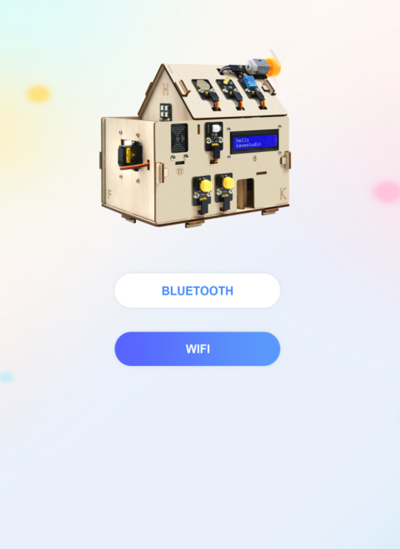
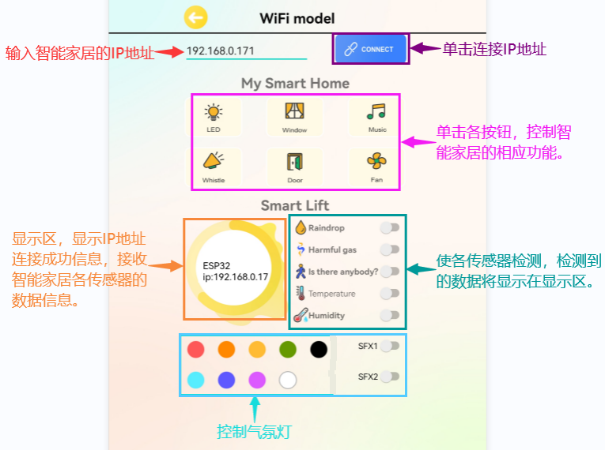
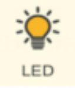
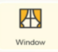
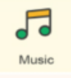
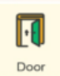
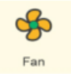
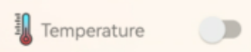
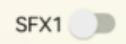

APP下载和使用说明
=================

.. _1安卓系统手机蓝牙app国内:

（1）安卓系统手机蓝牙APP（国内）：
----------------------------------

下载链接：\ |image1|\ https://xiazai.keyesrobot.cn/APP/keyes%20IoT%20home.apk
，下载完后，使用数据线转移到手机上去安装。

二维码下载（用手机浏览器上的扫描功能）：\ |image2|

下载安装后打开\ |image3|\ ，出现如下图界面。

|image4|

|image5|

上传测试代码成功，上电后

1. 打开APP，选择WIFI

|image6|

2. APP控制LED和风扇

手机需要和智能家居连接同一个WiFi，或者手机打开热点，智能家居连接手机的热点。

A. APP输入IP地址（LCD1602显示出分配到的IP地址）

B. 点击连接

C. 连接成功标志是显示区域显示ESP32 ip: 192.168.0.171

D. 然后就可以点击LED，可以看到智能家居的LED被打开

E. 点击Fan按钮，风扇被打开。如下图操作。

|image7|

|image8|

.. _2苹果系统手机平板电脑app:

（2）苹果系统手机（平板电脑）APP：
----------------------------------

打开 App Store。

|image9|

在 APP Store 上搜索 **keyes IoT home** ，点击获取，下载安装APP即可。

手机APP上各个按钮对应的控制字符和各个按钮对应的功能，这里我们整理了一个表格如下：

（注意：功能的实现需要上传第15课手机APP控制智能家居的程序）

+----------------+-------------------------+-------------------------+
| 按钮:|image42| | 功能：选择WIFI模式      |                         |
+================+=========================+=========================+
| 按钮:|image43| | 功能：连接              |                         |
+----------------+-------------------------+-------------------------+
| 按钮:|image44| | 控制字符：点一下发送    | 功能：点一下，开启LED灯 |
|                | “/led/on”；             | ；再点一下，关闭LED灯。 |
|                | 再                      |                         |
|                | 点一下发送“/led/off”。  |                         |
+----------------+-------------------------+-------------------------+
| 按钮:|image45| | 控制字符：点一下发送    | 功                      |
|                | “/window/on”；          | 能：点一下，开启窗户；  |
|                | 再点                    | 再点一下，关闭窗户。    |
|                | 一下发送“/window/off”。 |                         |
+----------------+-------------------------+-------------------------+
| 按钮:|image46| | 控制字符：点一下发送    | 功能：                  |
|                | “/music/on”。           | 点一下，播放一首歌曲。  |
+----------------+-------------------------+-------------------------+
| 按钮:|image47| | 控制字符：点一下发送    | 功能：点一              |
|                | “/buz/on”。             | 下，蜂鸣器“哔”响一声。  |
+----------------+-------------------------+-------------------------+
| 按钮:|image48| | 控制字符：点一下发送    | 功能：点一下，开启门；  |
|                | “/door/on”；            | 再点一下，关闭门。      |
|                | 再                      |                         |
|                | 点一下发送“/door/off”。 |                         |
+----------------+-------------------------+-------------------------+
| 按钮:|image49| | 控制字符：点一下发送    | 功                      |
|                | “/fan/on”；             | 能：点一下，开启风扇；  |
|                | 再                      | 再点一下，关闭风扇。    |
|                | 点一下发送“/fan/off”。  |                         |
+----------------+-------------------------+-------------------------+
| 按钮:|image50| | 控制字符：点一下发送    | 功能：点一下            |
|                | “/rain/on”；            | ，显示区显示雨滴值；再  |
|                | 再                      | 点一下，显示区显示off。 |
|                | 点一下发送“/rain/off”。 |                         |
+----------------+-------------------------+-------------------------+
| 按钮:|image51| | 控制字符：点一下发送    | 功能：点一下            |
|                | “/gas/on”；             | ，显示区显示危险气体状  |
|                | 再                      | 态safety或dangerous；再 |
|                | 点一下发送“/gas/off”。  | 点一下，显示区显示off。 |
+----------------+-------------------------+-------------------------+
| 按钮:|image52| | 控制字符：点一下发送    | 功                      |
|                | “/body/on”；            | 能：点一下，显示区显示  |
|                | 再                      | 人体检测状态someone或no |
|                | 点一下发送“/body/off”。 | one；再                 |
|                |                         | 点一下，显示区显示off。 |
+----------------+-------------------------+-------------------------+
| 按钮:|image53| | 控制字符：点一下发送    | 功能：点一下，          |
|                | “/temp/on”；            | 显示区显示温度数值；再  |
|                | 再                      | 点一下，显示区显示off。 |
|                | 点一下发送“/temp/off”。 |                         |
+----------------+-------------------------+-------------------------+
| 按钮:|image54| | 控制字符：点一下发送    | 功能：点一下，          |
|                | “/humidity/on”；        | 显示区显示湿度数值；再  |
|                | 再点一                  | 点一下，显示区显示off。 |
|                | 下发送“/humidity/off”。 |                         |
+----------------+-------------------------+-------------------------+
| 按钮:|image55| | 控制字符：点一下发送    | 功能：点一下            |
|                | “/sfx1/on”；            | ，RGB灯开启模式一氛围灯 |
|                | 再                      | ；再点一下，关闭RGB灯。 |
|                | 点一下发送“sfx1/off”。  |                         |
+----------------+-------------------------+-------------------------+
| 按钮:|image56| | 控制字符：点一下发送    | 功能：点一下            |
|                | “/sfx2/on”；            | ，RGB灯开启模式二跑马灯 |
|                | 再                      | ；再点一下，关闭RGB灯。 |
|                | 点一下发送“sfx2/off”。  |                         |
+----------------+-------------------------+-------------------------+
| 按钮:|image57| | 控制字符：点一下发送    | 功能：点一下，          |
|                | “/red/on”；             | RGB灯开启红色；再点一下 |
|                | 再点一下发送            | ，关闭RGB灯。以此类推。 |
|                | “/red/off”。以此类推。  |                         |
+----------------+-------------------------+-------------------------+

.. |image1| image:: media/f1ebec09a6a924e66654e11bbf3e8827.png
.. |image2| image:: media/049a27bbb2e7410c404f8a03aa9f0eef.png

.. |image5| image:: media/8e7c339852876017b41a39d5a0b31323.png
.. |image6| image:: media/d1cf201be878301328acdb765b4ec3b1.png
.. |image7| image:: media/426c73480e4513751bf99667b3ea7e58.png

.. |image9| image:: media/eeccf6fd30106842b44464a3dc598f0c.png

.. |image11| image:: media/26cffb5adfc9219ef70e870aedb103d9.png

.. |image22| image:: media/9d73f8b84fd4921ffe2c6db36ee2e165.png

.. |image24| image:: media/dfa0129c15a1af7746d954173fecb1a6.png

.. |image27| image:: media/26cffb5adfc9219ef70e870aedb103d9.png

.. |image38| image:: media/9d73f8b84fd4921ffe2c6db36ee2e165.png

.. |image40| image:: media/dfa0129c15a1af7746d954173fecb1a6.png

.. |image43| image:: media/26cffb5adfc9219ef70e870aedb103d9.png

.. |image54| image:: media/9d73f8b84fd4921ffe2c6db36ee2e165.png

.. |image56| image:: media/dfa0129c15a1af7746d954173fecb1a6.png

