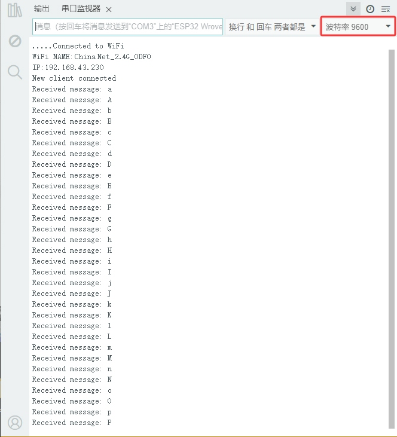
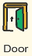

.. _11-app下载和使用说明:

11. APP下载和使用说明
=====================

.. _1-安卓系统手机蓝牙app国内:

1. 安卓系统手机蓝牙APP（国内）：
--------------------------------

方法1：下载链接: https://xiazai.keyesrobot.cn/APP/keyes%20IoT%20home.apk
，下载完后，使用USB数据线连接电脑的USB口和手机接线口，将 keyes iot
home.apk 文件转移到手机上去再安装。

|Img|

方法2：扫二维码下载（\ **注意：当我们扫码下载的时候需要使用手机浏览器的扫码功能扫码打开，使用微信扫码可能无效。**
）：

|image1|

方法3：对应文件夹里提供有 Android APP (keyes iot
home.apk)，使用USB数据线连接电脑的USB口和手机接线口，将 keyes iot
home.apk 文件转移到手机上去再安装。

|image2|

|image3|

下载安装后，单击\ |image4| 打开，出现如下图界面。

|image5|

选择WIFI

|image6|

|image7|

.. _2-苹果系统手机平板电脑app:

2. 苹果系统手机（平板电脑）APP：
--------------------------------

打开 App Store。

|image8|

在 APP Store 上搜索 **keyes IoT home** ，点击 |image9|
获取，下载安装APP即可。

下载安装后, 单击\ |image10| 打开，出现如下图界面。

|image11|

选择WIFI

|image12|

|image13|

.. _3-实验代码:

3. 实验代码：
-------------

⚠️ \ **特别提醒：**\ 这里只提供Arduino C 代码，Mixly代码 和
KidsBlock(Scratch)代码等在对应的教程里有提供，请到对应教程中查看，是
**第14课 WiFi控制**\ 。

⚠️ \ **特别提醒：**\ 
打开代码文件后，需要修改ESP32开发板需要连接的WiFi名称与密码，您需要分别将
``ChinaNet-2.4G-0DF0`` 和 ``ChinaNet@233`` 替换为您自己的 Wi-Fi 名称和
WiFi
密码。WiFi名称和WiFi密码修改后才能上传代码，否则你的ESP32开发板将无法连接网络。

.. code:: c

   const char* ssid = "ChinaNet-2.4G-0DF0";  //输入你自己的WiFi名称
   const char* pwd = "ChinaNet@233"; //输入你自己的WiFi密码

⚠️ **注意：
请确保代码中的WiFi名称和WiFi密码与连接到您的计算机、手机/平板电脑、ESP32开发板和路由器的网络相同，它们必须在同一局域网（WiFi）内。**

⚠️ **注意：WiFi必须是2.4Ghz频率的，否则ESP32无法连接WiFi**\ 。

.. code:: c

   /*
     Keyes
     Read-APP-Characters
     www.keyes-robot.com
   */

   #include <Arduino.h>
   #ifdef ESP32
   #include <WiFi.h>
   #elif defined(ESP8266)
   #include <ESP8266WiFi.h>
   #endif

   #include <LiquidCrystal_I2C.h>

   const char* ssid = "ChinaNet-2.4G-0DF0";
   const char* pwd = "ChinaNet@233";

   #include <Wire.h>
   //初始化LCD地址和行列
   LiquidCrystal_I2C lcd(0x27, 16, 2);

   WiFiServer server(80);  //初始化WiFi服务

   //将变量定义为检测到的值
   String request;

   unsigned long prevTask = 0;

   void setup() {
     Serial.begin(9600);
     //连接 wifi
     WiFi.begin(ssid, pwd);
     //确定是否已连接
     Serial.println("Connecting to WiFi...");
     while (WiFi.status() != WL_CONNECTED) {
       delay(1000);
       Serial.print(".");
     }
     delay(1000);
     //串行监视器会显示无线网络的名称和 IP 地址
     Serial.println("Connected to WiFi");
     Serial.print("WiFi NAME:");
     Serial.println(ssid);
     Serial.print("IP:");
     Serial.println(WiFi.localIP());

     //初始化 LCD
     lcd.init();
     // 打开LCD背光
     lcd.backlight();
     //lcd.noBacklight();
     lcd.clear();
     //设置光标的位置
     lcd.setCursor(0, 0);
     //LCD 打印
     lcd.print("IP:");
     //设置光标的位置
     lcd.setCursor(0, 1);
     //LCD 打印
     lcd.print(WiFi.localIP());

     //开启服务
     server.begin();
   }

   void loop() {
     //检查客户端是否已连接到网络服务器
     //当客户端与服务器建立连接时，“server.available()”函数会返回一个用于客户端端通信的 WiFiClient对象。
     WiFiClient client = server.available();
     if (client) {
       Serial.println("New client connected");
       while (client.connected()) {
         //确定服务器是否发送数据
         if (client.available()) {
           request = client.readStringUntil('s');
           Serial.print("Received message: ");
           Serial.println(request);
         }
         request = "";
       }
       Serial.println("Client disconnected");
     }
   }

.. _4-实验结果:

4. 实验结果：
-------------

上传测试代码成功，上电后，手机需要和智能家居连接同一个WiFi，或者手机打开热点，智能家居连接手机的热点。单击串口监视器，打开串口监视器窗口，设置波特率为9600，串口监视器窗口打印分配到的IP地址。

⚠️
**注意：手机或平板一定要与ESP32开发板连接的是同一个WiFi，否则将无法进入控制页面，还有就是ESP32开发板在使用WiFi功能时功耗很大需要外接DC电源才能满足它的工作电力需求，如果达不到它的工作电力需求ESP32板将会一直复位导致代码无法正常运行。**

A.
APP输入IP地址（LCD1602显示出分配到的IP地址或IDE的串口监视器窗口显示的IP地址）

B. 点击 **CONNECT** 连接IP地址

C. 连接成功标志是跳出 Connected 字样，需要注意看。

D. 然后就可以按如下图操作。

|image14|

E. 手机APP上各个按钮对应的控制字符

|image15|

手机APP上各个按钮对应的控制字符和各个按钮对应的功能，这里我们整理了一个表格如下：

+----------------+-------------------------+-------------------------+
| 按钮:|image48| | 功能：选择WIFI模式      |                         |
+================+=========================+=========================+
| 按钮:|image49| | 功能：连接              |                         |
+----------------+-------------------------+-------------------------+
| 按钮:|image50| | 控制字符：点一下发送    | 功能：点一下，开启LED灯 |
|                | “a”； 再点一下发送“A”。 | ；再点一下，关闭LED灯。 |
+----------------+-------------------------+-------------------------+
| 按钮:|image51| | 控制字符：点一下发送    | 功                      |
|                | “b”； 再点一下发送“B”。 | 能：点一下，开启窗户；  |
|                |                         | 再点一下，关闭窗户。    |
+----------------+-------------------------+-------------------------+
| 按钮:|image52| | 控制字符：点一下发送    | 功能：                  |
|                | “c”。                   | 点一下，播放一首歌曲。  |
+----------------+-------------------------+-------------------------+
| 按钮:|image53| | 控制字符：点一下发送    | 功能：点一              |
|                | “d”。                   | 下，蜂鸣器“哔”响一声。  |
+----------------+-------------------------+-------------------------+
| 按钮:|image54| | 控制字符：点一下发送    | 功能：点一下，开启门；  |
|                | “e”； 再点一下发送“E”。 | 再点一下，关闭门。      |
+----------------+-------------------------+-------------------------+
| 按钮:|image55| | 控制字符：点一下发送    | 功                      |
|                | “f”； 再点一下发送“F”。 | 能：点一下，开启风扇；  |
|                |                         | 再点一下，关闭风扇。    |
+----------------+-------------------------+-------------------------+
| 按钮:|image56| |                         | 功                      |
|                |                         | 能：显示区显示雨滴值。  |
+----------------+-------------------------+-------------------------+
| 按钮:|image57| |                         | 功能：显示区显示危险气  |
|                |                         | 体状态safe或dangerous。 |
+----------------+-------------------------+-------------------------+
| 按钮:|image58| |                         | 功能：显示区显示        |
|                |                         | 人体检测状态someone或no |
|                |                         | one。                   |
+----------------+-------------------------+-------------------------+
| 按钮:|image59| |                         | 功                      |
|                |                         | 能：显示区显示温度数值  |
+----------------+-------------------------+-------------------------+
| 按钮:|image60| |                         | 功                      |
|                |                         | 能：显示区显示湿度数值  |
+----------------+-------------------------+-------------------------+
| 按钮:|image61| | 控制字符：点一下发送    | 功能：点一下            |
|                | “o”； 再点一下发送“O”。 | ，RGB灯开启模式一氛围灯 |
|                |                         | ；再点一下，关闭RGB灯。 |
+----------------+-------------------------+-------------------------+
| 按钮:|image62| | 控制字符：点一下发送    | 功能：点一下            |
|                | “p”； 再点一下发送“P”。 | ，RGB灯开启模式二跑马灯 |
|                |                         | ；再点一下，关闭RGB灯。 |
+----------------+-------------------------+-------------------------+
| 按钮:|image63| | 控制字符：点一下发送    | 功能：点一下，          |
|                | “g”；                   | RGB灯开启红色；再点一下 |
|                | 再点                    | ，关闭RGB灯。以此类推。 |
|                | 一下发送“G”。以此类推。 |                         |
+----------------+-------------------------+-------------------------+

.. |image1| image:: media/QR-code.png

.. |image5| image:: media/IOT-home1.png
.. |image6| image:: media/IOT-home2.png
.. |image7| image:: media/IOT-home3.png

.. |image11| image:: media/IOT-home1.png
.. |image12| image:: media/IOT-home2.png
.. |image13| image:: media/IOT-home3.png
.. |image14| image:: media/APP0.png

.. |image16| image:: media/WIFI-mode.png

.. |image20| image:: media/music.png
.. |image21| image:: media/whistle.png

.. |image23| image:: media/fan.png

.. |image28| image:: media/humidy.png

.. |image30| image:: media/sfx2.png
.. |image31| image:: media/rgb.png
.. |image32| image:: media/WIFI-mode.png

.. |image36| image:: media/music.png
.. |image37| image:: media/whistle.png

.. |image39| image:: media/fan.png

.. |image44| image:: media/humidy.png

.. |image46| image:: media/sfx2.png
.. |image47| image:: media/rgb.png
.. |image48| image:: media/WIFI-mode.png

.. |image52| image:: media/music.png
.. |image53| image:: media/whistle.png

.. |image55| image:: media/fan.png

.. |image60| image:: media/humidy.png

.. |image62| image:: media/sfx2.png
.. |image63| image:: media/rgb.png
