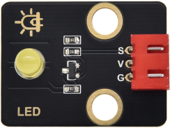
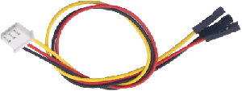
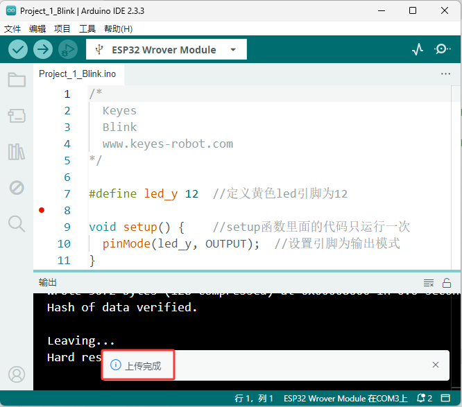
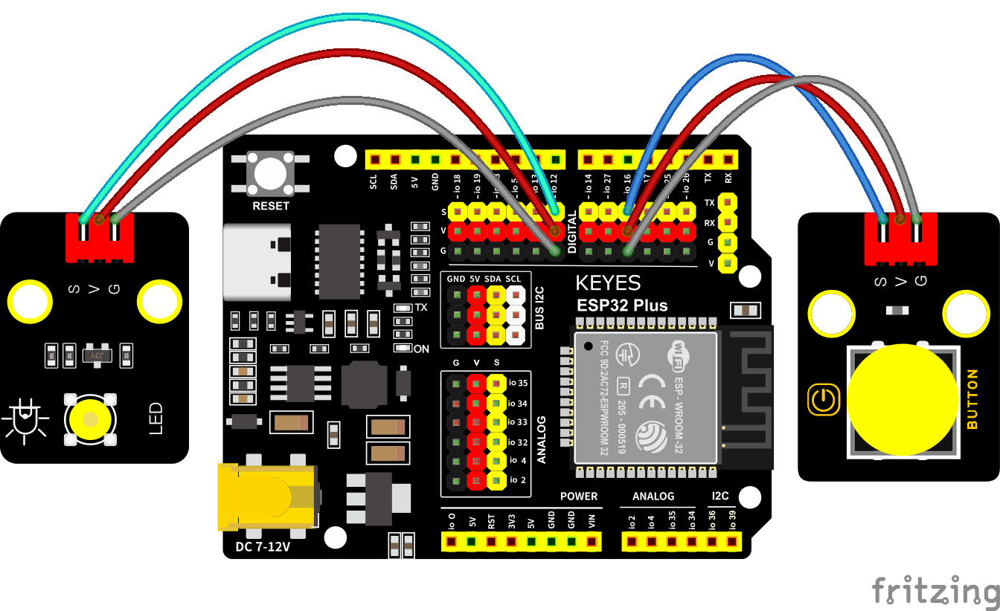
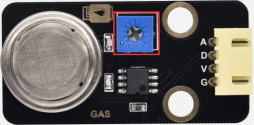
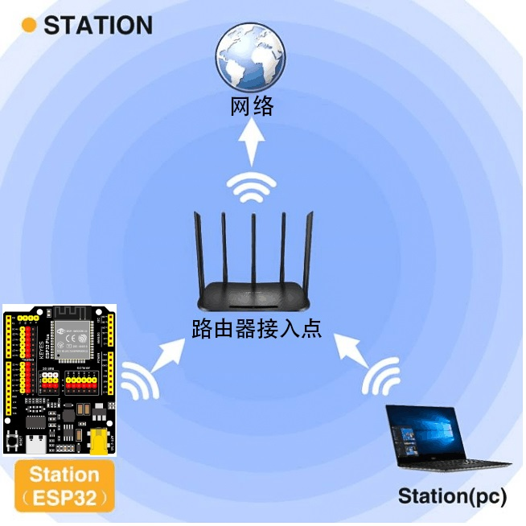
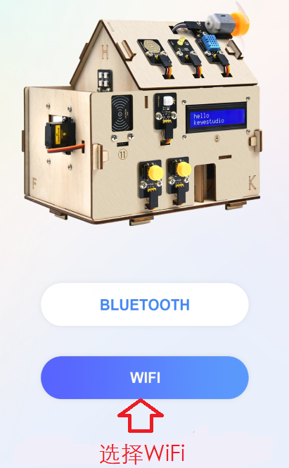
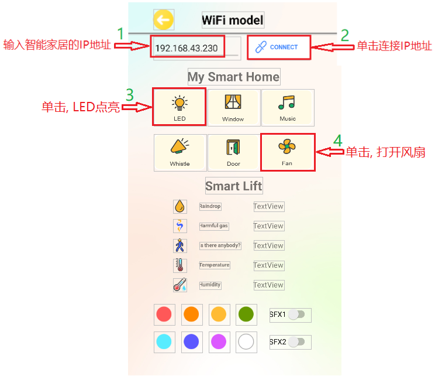

# 7. Arduino 教程

## 7.1. Arduino 资料下载

<span style="color: rgb(255, 76, 65);">**⚠️特别提示:** </span> 请先下载本教程需要用到的Arduino资料(包含：Arduino代码、取模软件和库文件）和Android_APP等，保存至您方便使用的路径下。

**下载：**  [Arduino资料](./Arduino资料.7z) 和 [Android_APP](./Android_APP.7z)

## 7.2 Arduino开发环境配置

### 7.2.1 Arduino IDE 简介

Arduino IDE是一款专为Arduino硬件设计的集成开发环境，它以初学者友好的界面和强大的开源代码支持而闻名。这款工具不仅简化了编程过程，降低了开发门槛，还为初学者提供了一个易于上手的学习平台。

Arduino IDE拥有简洁直观的用户界面，支持语法高亮、自动完成等功能，使得编程过程变得轻松愉快。更重要的是，它基于开放源代码，这意味着用户可以自由访问、修改和分发代码，从而大大扩展了开发的可能性。

对于初学者来说，Arduino IDE提供了丰富的教程、示例代码和社区支持，帮助他们快速上手并解决实际问题。同时，开源代码的特性也意味着用户可以借鉴和学习他人的代码，加速自己的学习进程。

总之，Arduino IDE以其初学者友好的界面和强大的开源代码支持，成为了Arduino开发者不可或缺的工具之一，无论是初学者还是专业人士，都能从中受益。

### 7.2.2  Windows 系统

**特别提醒：本教程采用的 Arduino IDE 版本是 2.3.6 。如果是其他版本的话，不能保证本教程提供的示例代码能编译和上传成功。** 

#### 7.2.2.1 Arduino IDE下载 

我们先到Arduino官方的网站：[Software | Arduino](https://www.arduino.cc/en/software/) 下载 Arduino IDE。

Arduino 软件有很多版本，有Windows，Mac，Linux系统的（如下图），而且还有过去老的版本，你只需要下载一个适合自己计算机系统的版本即可。

这里是以下载 **Windows Win 10 or newer(64-bit)** 为例，你也可以根据自己所需，选择下载 **Windows ZIP file**。选择如下图。


这里我们以Windows系统的为例给大家介绍下载和安装的步骤。Windows系统的也有两个版本，一个版本是安装版：Windows Win 10 or newer(64-bit) ；另一个是下载版：Windows ZIP file，是不用安装，直接下载文件到电脑，解压缩就可以用了。

#### 7.2.2.2 Arduino IDE安装

1\. 保存从软件页面下载的.exe文件到硬盘驱动器，然后简单地运行该文件.


2\. 阅读许可协议并同意.


3\. 选择安装选项.


4\. 选择安装位置.


5\. 单击 "Finish" 并运行Arduino IDE


### 7.2.3 MacOS 系统

#### 7.2.3.1 Arduino IDE下载

我们先到Arduino官方的网站：[Software | Arduino](https://www.arduino.cc/en/software/) 下载 Arduino IDE。

不同的系统，需要下载不同的Arduino IDE，下载方式和Windows类似。这里是以下载 **macOS Intel 10.15 Catalina or newer(64-bit)** 为例，你也可以根据自己所需，选择下载 **macOS Apple Silicon 11 Big Sur or newer(64-bit)**。选择如下图。


#### 7.2.3.2 Arduino IDE安装

Arduino IDE下载之后，双击下载的`arduino_ide_xxxx.dmg`文件并按照说明将 **Arduino IDE.app** 复制粘贴到 **Applications** 文件夹，几秒钟后您将看到 Arduino IDE 安装成功.


### 7.2.4 Linux 系统

#### 7.2.4.1 Arduino IDE下载

我们先到Arduino官方的网站：[Software | Arduino](https://www.arduino.cc/en/software/) 下载 Arduino IDE。

不同的系统，需要下载不同的Arduino IDE，下载方式和Windows类似。这里是以下载 **Linux Applmage(64-bit X86-64)** 为例，你也可以根据自己所需，选择下载 **Linux ZIP file(64-bit X86-64)**。选择如下图。


#### 7.2.4.2 Arduino IDE安装

关于在 Linux 系统上安装 Arduino IDE 2 的教程，请参考链接：[https://docs.arduino.cc/software/ide-v2/tutorials/getting-started/ide-v2-downloading-and-installing/#linux](https://docs.arduino.cc/software/ide-v2/tutorials/getting-started/ide-v2-downloading-and-installing/#linux)

### 7.2.5 设置Arduino IDE语言

⚠️ **特别提醒：Windows系统、MAC系统等不同系统，arduino IDE语言设置方法差不多，可以参考。**

1\. 首先打开Arduino IDE.


2\. 点击“**File** ——>**Preferences...**”，在**Preferences**对话框中，单击 “**English**” 按钮选择 “**中文(简体)**”，然后单击 “**OK**”.


3\. 这样，arduino IDE的语言切换完成了，arduino IDE的语言为中文(简体)。


### 7.2.6 Arduino IDE说明


1\. “文件”：列表里面的功能有新建项目，打开程序，打开最近使用的代码，打开示例代码，关闭IDE，保存代码，首选项，高级设置等。

2\. “编辑”：列表里面的功能有复制，粘贴，自动格式化，字体大小等这个一般都是使用快捷键进行操作。（建议坚持使用快捷键，接触多了就水到渠成了）。

3\. “项目”：列明里面的常用功能有验证\编译代码，上传代码，导入库等。

4\. “工具”：列表里面的常用功能有开发板选择，端口选择，这两个很重要。

5\. “帮助”：点击这个可以查看IDE版本已经官方的参考文件。

6\. “串口绘图仪”：它会将串口的数据以折线图的样式显示出来。

7\. “串口监视器”：可以将我们需要查看的数据在这里进行打印显示。

8\. 验证程序按钮。

9\. 验证并上传程序按钮。

10\. “项目文件夹”：可以新建项目，还可以只有arduino Cloud进行同步和编辑。

11\. “开发板管理器”：可以添加或删除开发板。

12\. “库管理”：就要添加和删除库。

13\. “调试”：可以对代码进行监视与断点调试。

14\. 搜索框。

15\. 代码编辑区。

16\. IDE提示区（上传代码报错或成功）和串口监视器显示区

至此Arduino IDE说明教程结束了，请学习如何给Arduino IDE添加库文件，如果没有添加库文件IDE会报错。

### 7.2.7 给Arduino IDE安装库文件(**重要**)

⚠️ **特别提醒：Windows系统、MAC系统等不同系统，安装库文件的方法差不多，可以相互参考；这里是以Windows系统为例。**

#### 7.2.7.1 什么是库文件

库是代码的集合，使您可以轻松地连接到传感器、显示器、模块等。

例如：LiquidCrystal_I2C库使LCD1602显示变得容易，Internet上有数百个其他库可供下载。参考中列出了内置库和手动添加的库。 

在编译代码或上传代码时，如果出现报错信息 “No such file or directory”，那说明缺少相应的库文件，如下图就是上传LCD1602模块代码时因为缺少了LiquidCrystal_I2C库文件的报错。


#### 7.2.7.2 如何安装库文件

在这里，我们将为您介绍最简单的添加库的方法。我们是以添加LiquidCrystal_I2C库文件为例。

1\. 首先，依次点击左上角的 “**项目” > “导入库” > “添加 .Zip 库...”**


2\. 导航到库文件所在的目录，例如：***Arduino资料\Arduino_库文件*** 文件夹，然后选择对应的库文件（这里是以LiquidCrystal_I2C库文件为例，.zip格式），单击 “**打开(O)**”，即可添加成功。


3\. 安装完成后，你将收到一条通知(已从LiquidCrystal_12C.zip存档成功安装库)，同时输出框会显示 “**Library installed**”，确认该库已成功添加到Arduino IDE中。下次需要使用此库时，你不需要重复安装过程。


4\. 重复前面相同的添加过程(方法)来添加其他(剩余)的库文件，这里就不一一重复讲解了。

### 7.2.8 安装 ESP32 开发板(**重要**)

⚠️ **特别提醒：国内客户下载安装ESP32 开发板，由于网速原因需要网络翻墙，这样，ESP32 开发板更容易下载。**

#### 7.2.8.1 Windows系统

我们发现在arduino IDE “**工具**”下的 “**开发板**” 中找不到ESP32开发板的选项，这是因为我们没有添加ESP32开发板，接下来我们一起来为Arduino IDE添加ESP32开发板吧!


**安装ESP32开发板步骤如下：**

1\. 首先打开Arduino IDE.


2\. 点击“**文件** ——>**首选项...**”，在**其他开发板管理器地址**中，将ESP32开发板的链接：`https://espressif.github.io/arduino-esp32/package_esp32_index.json` 复制粘贴至文本框中，然后单击 “**确定**”.


3\. 再点击 “**确定**”。


4\. 点击左边的开发板小图标，打开开发板选项。


5\. 在开发板搜索框中，搜索 “**ESP32**”，点击安装最新版本，右下角可以看到开发板安装进度，等待几分钟安装完成。**安装过程中请保持网络稳定，如安装失败，请重复以上步骤，重新安装开发板即可。**

⚠️ **注意：本教程使用的是 ESP32 3.2.1 版本的ESP32开发板，请保持一致，以免出现代码不兼容情况。**


⚠️ **特别提醒：假如，由于网络问题实在是下载安装不了ESP32开发板，我们也提供有ESP32开发板的压缩包**，**ESP32开发板的压缩包下载地址：** [https://pan.baidu.com/s/10mfU2_aNru2dizP0vAFXlw?pwd=95ih](https://pan.baidu.com/s/10mfU2_aNru2dizP0vAFXlw?pwd=95ih) 

**提取码：95ih**

**压缩包下载后解压，把解压后的ESP32开发板文件夹按照以下路径添加。ESP32开发板一般需要存放于以下路径，才能说明ESP32开发板安装好。**

- **Windows 系统**：路径为C:\Users\你的用户名\AppData\Local\Arduino15\packages 。其中，AppData 是一个隐藏文件夹，你需要在文件夹选项中开启 “显示隐藏的文件、文件夹和驱动器” 才能看到。

⚠️ **提醒：** 上面路径中“你的用户名”是指你安装电脑时设置的用户名字，如果没有设置，一般都是Administrator。

- **MacOS 系统**：位于~/Library/Arduino15/packages。Library 也是一个隐藏文件夹，你可以通过在 “**访达**” 中使用快捷键Command + Shift + G ，然后输入该路径来访问。

- **Linux 系统**：存于~/.arduino15/packages 。

6\. 安装成功后，重新启动 Arduino IDE，然后点击“**工具**” → “**开发板:**”，这样就可以看到安装成功的ESP32开发板。安装成功如图：


#### 7.2.8.2 MAC系统

上面已经学习了怎么下载ArduinoIDE，那下面就要在Arduino IDE上安装ESP32开发板，请执行以下步骤：

**安装ESP32开发板步骤如下：**

1\. 首先打开Arduino IDE，点击“**Arduino IDE** ——>**首选项...**”，在**其他开发板管理器地址**中，将ESP32开发板的链接：`https://espressif.github.io/arduino-esp32/package_esp32_index.json` 复制粘贴至文本框中，，然后单击 “**确定**”.


3\. 再点击 “**确定**”。


4\. 点击 “**工具**” ——> “**开发板**”  ——> “**开发板管理器...**”。


5\. 在开发板搜索框中，搜索 “**ESP32**”，点击安装最新版本，右下角可以看到开发板安装进度，等待几分钟安装完成。**安装过程中请保持网络稳定，如安装失败，请重复以上步骤，重新安装开发板即可。**

⚠️ **注意：本教程使用的是 ESP32 3.2.1 版本的ESP32开发板，请保持一致，以免出现代码不兼容情况。**


6\. 安装成功后，重新启动 Arduino IDE，然后点击“**工具**” → “**开发板:**”，这样就可以看到安装成功的ESP32开发板。安装成功如图：


### 7.2.9 使用Arduino IDE上传第一个程序

先将ESP32开发板通过USB线连接到电脑。


打开Arduino IDE, 选择对应的ESP32开发板型号。


选好开发板后，选择开发板的COM口，开发板安装完驱动后会显示一个COM端口，如果你不知道是哪个，可以进入你电脑的设备管理器中进行查看，如下图：（如果你有很多COM端口，你不知道是哪个就可以拔掉ESP32开发板看哪个消失了，然后再插上ESP32开发板消失的COM口又会显示出来，如果没有COM就请检查是否有安装好开发板驱动）


从图中可知我们的COM端口是COM3，我们在 “**工具**” 列表中选择 “**端口**” 然后选择 “COM3”。


连接上开发板后，这两个地方都会显示已连接的标志，然后添加代码：这里我们提供一个示例代码，代码功能是在串口监视器中每隔一秒钟打印一次“Hello Keyes!”。

将下面的代码复制粘贴到arduino IDE的代码区

```c
/*
  keyes 
  打印 “Hello Keyes!”
  http://www.keyesrobot.com
*/
void setup() {  
    // 把你的设置代码放在这里，运行一次:
    Serial.begin(9600);  //设置串口波特率为9600
}

void loop() {  
    // 将主代码放在这里，以便重复运行:
    Serial.println("Hello Keyes!");  //串口打印
 	delay(1000);  //延迟1秒
}
```


然后我们点击编译并上传代码，上传成功后IDE也会有两个提示，如图：


然后我们点击“串口监视器”图标便能打开串口监视器，然后设置波特率为**9600**，就能看到串口打印字符串 “**Hello Keyes!**”


1\. “切换自动滚动”：设置打印窗口是否跟随打印.

2\. “切换时间戳”：设置是否显示打印时间。

3\. “清除输出 /清空输出”：清除打印窗口中的数据。

4\. 串口输入框。

5\. 串口发送格式。

6\. 设置波特率，点击即可选择需要的波特率。

7\. 打印窗口。

### 7.2.10 Arduino基础代码介绍

更多详细解释请参考官方链接：[Language Reference | Arduino Documentation](https://docs.arduino.cc/language-reference/)

---------------

## 7.3. 项目教程

⚠️ **<span style="color: rgb(255, 76, 65);">特别提醒</span>：ESP32智能家居已经组装好了，接下来进入项目教程，以下各个项目中的传感器模块都不需要拆下来又重新组装和接线，每个项目再次提供接线图，是为了方便您编写代码！**

### 第1课 LED闪烁

**1.1. 项目介绍：**

前面我们已经组装好了智能家居。接下来的项目我们就要由简单到复杂，一步一步探索Arduino的世界了。首先我们要来完成经典的“Arduino点亮LED”，也就是Blink项目。Blink对于学习Arduino的爱好者而言，是最基础的项目，也是新手必须经历的一个练习。

LED，即发光二极管的简称。由含镓（Ga）、砷（As）、磷（P）、氮（N）等的[化合物](https://baike.baidu.com/item/%E5%8C%96%E5%90%88%E7%89%A9/1142931)制成。当电子与[空穴](https://baike.baidu.com/item/%E7%A9%BA%E7%A9%B4/3517781)复合时能辐射出可见光，因而可以用来制成发光二极管。在电路及仪器中作为指示灯，或者组成文字或数字显示。砷化镓二极管发红光，磷化镓二极管发绿光，碳化硅二极管发黄光，氮化镓二极管发蓝光。因化学性质又分有机发光二极管OLED和无机发光二极管LED。

为了实验的方便，我们将LED发光二极管做成了一个LED模块，在这个项目中，我们用一个最基本的测试代码来控制LED，亮一秒钟，灭一秒钟，来实现闪烁的效果。你可以改变代码中LED灯亮灭的时间，实现不同的闪烁效果。LED模块信号端S为高电平时LED亮起，S为低电平时LED熄灭。

**1.2. 模块相关资料：**


|工作电压:|DC 3.3-5V|
|-|-|
|工作电流：| 20mA|
|最大功率：|0.1W|
|控制接口:|数字口（数字输入）|
|工作温度：|-10°C ~ +50°C|
|LED显示颜色：|黄色|

**1.3. 实验组件：**

|||||
|-|-|-|-|
|ESP32 Plus主板 * 1|黄色LED模块*1|3P 转杜邦线母*1|USB线*1|

**1.4. 模块接线图：**

黄色LED灯的控制引脚：

* 黄色LED灯（S引脚）io12


<span style="color: rgb(255, 76, 65);">注意：</span>这里体现的是实验使用到的模块接线图，若前面已经组装好智能家居并不用拆掉

**1.5. 实验代码：** 

```c
/*  
 * 项目: led
 * 描述: LED闪烁
 * 编译IDE：ARDUINO IDE
 * 作者: http//www.keyes-robot.com
*/
#define led_y 12  // 定义黄色LED引脚为12

void setup()  
{    // setup函数中的代码只运行一次  
  pinMode(led_y, OUTPUT);  // 设置引脚为输出模式 
}

void loop()  
{     // 循环函数内的代码反复运行
  digitalWrite(led_y, HIGH);  // 设置led_y引脚为HIGH（打开LED）
  delay(200);     // 以毫秒为单位的延迟 
  digitalWrite(led_y, LOW);   // 设置led_y引脚为LOW（关闭LED）
  delay(200);  
}
```

怎么上传程序？

打开目录下我们提供的示例程序，选择开发板和串口，点击编译没错再上传。


上传成功会在软件的左下角有提示。




**1.6. 实验结果：**

将示例代码上传到主板，上传成功后，外接电源供电，可以看到黄色LED灯不断地闪烁。

**1.7. 代码说明:**

|pinMode(led_y, OUTPUT);|设置引脚为输出模式|
|-|-|
|digitalWrite(led_y, HIGH);|设置引脚输出高电平|
|delay(200);|延时200毫秒|
|digitalWrite(led_y, LOW);|设置引脚输出低电平|

### 第2课 呼吸灯

**1.1. 项目介绍：**

在之前的研究中，我们知道LED有亮/灭状态，那么如何进入中间状态呢?如何输出一个中间状态让LED“半亮”?这就是我们将要学习的。呼吸灯，即LED由灭到亮，再由亮到灭，就像“呼吸”一样。那么，如何控制LED的亮度呢?我们将使用ESP32的PWM来实现这个目标。

**1.2. 模块相关资料：**


|工作电压:|DC 3.3-5V|
|-|-|
|工作电流：| 20mA|
|最大功率：|0.1W|
|控制接口:|数字口（数字输入）|
|工作温度：|-10°C ~ +50°C|
|LED显示颜色：|黄色|

**1.3. 元件知识：** 


**Analog & Digital**

模拟信号在时间和数值上都是连续的信号。相反，数字信号或离散时间信号是由一系列数字组成的时间序列。生活中的大多数信号都是模拟信号。一个熟悉的模拟信号的例子是，全天的温度是如何不断变化的，而不是突然从0到10的瞬间变化。然而，数字信号的值可以瞬间改变。这个变化用数字表示为1和0(二进制代码的基础)。如下图所示，我们可以更容易地看出它们的差异。


在实际应用中，我们经常使用二进制作为数字信号，即一系列的0和1。由于二进制信号只有两个值(0或1)，因此具有很大的稳定性和可靠性。最后，可以将模拟信号和数字信号相互转换。

**PWM：**

脉宽调制(PWM)是一种利用数字信号控制模拟电路的有效方法。普通处理器不能直接输出模拟信号。PWM技术使这种转换(将数字信号转换为模拟信号)非常方便。PWM技术利用数字引脚发送一定频率的方波，即高电平和低电平的输出，交替持续一段时间。每一组高电平和低电平的总时间一般是固定的，称为周期(注:周期的倒数是频率)。高电平输出的时间通常称为脉宽，占空比是脉宽(PW)与波形总周期(T)之比的百分比。高电平输出持续时间越长，占空比越长，模拟信号中相应的电压也就越高。下图显示了对应于脉冲宽度0%-100%的模拟信号电压在0V-3.3V(高电平为3.3V)之间的变化情况.


PWM占空比越长，输出功率越高。既然我们了解了这种关系，我们就可以用PWM来控制LED的亮度或直流电机的速度等等。从上面可以看出，PWM并不是真实的模拟信号，电压的有效值等于相应的模拟信号。因此，我们可以控制LED和其他输出模块的输出功率，以达到不同的效果。

**ESP32 与 PWM**

在ESP32上，LEDC(PWM)控制器有16个独立通道，每个通道可以独立控制频率，占空比，甚至精度。与传统的PWM引脚不同，ESP32的PWM输出引脚是可配置的，每个通道有一个或多个PWM输出引脚。最大频率与比特精度的关系如下公式所示：


其中比特的最大值为31。例如,生成PWM的8位精度(2的8次方 = 256。取值范围为0 ~ 255)，最大频率为80,000,000/255 = 312,500Hz。)

我们为ESP32提供PWM输出的库文件\<analogWrite.h\>，因此只要非常简单的一条语句analogWrite();就可以控制PWM输出了。

**1.4. 实验组件：**

|||||
|-|-|-|-|
|ESP32 Plus主板 * 1|黄色LED模块*1|3P 转杜邦线母*1|USB线*1|

**1.5. 模块接线图：**

黄色LED的控制引脚：

* 黄色LED灯（S引脚）io12


**注意：** 这里体现的是实验使用到的模块接线图，若前面已经组装好智能家居并不用拆掉

**1.6. 实验代码：** 

```c
/*  
 * 项目: breath_led
 * 描述: LED渐亮渐暗,实现呼吸灯的效果
 * 编译IDE：ARDUINO IDE
 * 作者: http//www.keyes-robot.com
*/
#include <Arduino.h>
#define led_y 12    // 定义LED引脚

void setup()
{
  pinMode(led_y, OUTPUT);  // 设置引脚为输出模式
}

void loop()
{
  for(int i = 0; i < 255; i++)  // For循环：增加变量i到255
  {
    analogWrite(led_y, i);  // PWM输出控制LED亮度
    delay(3);
  }
  
  for(int i = 255; i > 0; i--)  // For循环：递减变量i到0
  {
    analogWrite(led_y, i);
    delay(3);
  }
}
```

**1.7. 实验结果：**

将示例代码上传到主板，上传成功后，外接电源供电，可以看到黄色LED灯渐亮渐暗，似乎在呼吸。

**1.8. 代码说明:**

|pinMode(LED, OUTPUT);|设置引脚为输出模式|
|-|-|
|int i = 0; 255; i ++|i从0到255，每次加1|
|analogWrite (led_y, i);|Led_y为PWM口，i是要输出的PWM值（0~255）|

### 第3课 台灯

**1.1. 项目介绍：**

常见的台灯，用到了LED灯和按键。通过按按键来控制灯的开与关。

按键按下，我们的单片机读取到低电平，松开读取到高电平。在这一实验课程中，我们利用按键和黄色LED做一个扩展，当按键按下时即读取到低电平时点亮黄色LED灯，松开按键时即读取到高电平时熄灭黄色LED灯，这样就可以通过一个模块控制另一个模块了。

**1.2. 模块相关资料：**


附原理图，按键有四个引脚，其中1和3是相连的，2和4是相连的，在我们未按下按键时，13与24是断开的，信号端S读取的是被4.7K的上拉电阻R1所拉高的高电平，而当我们按下按键时，13和24连通。信号端S连接到了GND，此时读取到的电平为低电平，即按下按键，传感器信号端为低电平；松开按键时，信号端为高电平。

**1.3. 实验组件：**

||||||
|-|-|-|-|-|
|ESP32 Plus主板 * 1|黄色LED模块*1|按键*1|3P 转杜邦线母*2|USB线*1|

**1.4. 模块接线图：**

木板房子⑦处按键1和黄色LED的控制引脚：

|木板房子⑦处按键1（S引脚）|io16|
|-|-|
|黄色LED灯（S引脚）|io12|



**1.5. 读取按钮值的实验代码：** 

读取按钮的状态值，在串口监视器中显示出来，这样就可以直观的看到按钮的状态值。

```c
/*  
 * 项目: button
 * 描述: 读取按键的高低电平
 * 编译IDE：ARDUINO IDE
 * 作者: http//www.keyes-robot.com
*/
#define btn1 16

void setup() {
  Serial.begin(9600);
  pinMode(btn1, INPUT);
}

void loop() {
  boolean btn1_val = digitalRead(btn1);
  Serial.print("button1 = ");
  Serial.println(btn1_val);
  delay(100);
}
```

**1.6. 实验结果1：**

上传测试代码成功，上电后，点击打开arduino IDE的串口监视器，设置波特率为9600，如下图操作。


再按下⑦处的按键1就可以看到按键状态值的改变，如下图。


**1.7. 台灯的实验代码：** 

计算按键被点击的次数，然后再对计算的次数进行对2求余数，即可得到0或1两种状态值。

```c
/*  
 * 项目: music
 * 描述: 按键切换歌曲
 * 编译IDE：ARDUINO IDE
 * 作者: http//www.keyes-robot.com
*/
#include <musicESP32_home.h>   
music Music(25);  // 在GPIO25上初始化音乐播放器
#define btn1 16    // 按钮引脚
int btn_count = 0; // 按键计数器
boolean music_flag = 0; // 触发音乐播放的标志

void setup() 
{
  Serial.begin(9600);
  pinMode(btn1, INPUT);
  // 可供选择的音乐：
  // Music.tetris();
  // Music.birthday();
  // Music.Ode_to_Joy();
  // Music.christmas();
  // Music.star_war_tone();
}

void loop() 
{
  boolean btn1_val = digitalRead(btn1);
  
  if(btn1_val == 0) // 按下按钮
  {
    delay(10);  // 脱扣延迟10ms
    
    if(btn1_val == 0) // 确认按钮仍按下
    {
      boolean btn_state = 1;
      
      while(btn_state == 1) // 等待按钮被释放
      {
        boolean btn_val = digitalRead(btn1);
        
        if(btn_val == 1)  // 松开按钮
        {
          music_flag = 1;
          btn_count++;    // 增量按下按键计数器
          Serial.println(btn_count);
          
          // Cycle through 1-3 count
          if(btn_count == 4)
          {
            btn_count = 1;
          }
          
          // 根据播放次数播放不同的歌曲
          switch(btn_count)
          {
            case 1: 
              if(music_flag == 1)
              {
                Music.Ode_to_Joy();
                music_flag=0;
              } 
              break;
              
            case 2: 
              if(music_flag == 1)
              {
                Music.christmas();
                music_flag=0;
              } 
              break;
              
            case 3: 
              if(music_flag == 1)
              {
                Music.tetris();
                music_flag=0;
              } 
              break;
          }
          
          btn_state = 0;  // 退出等待循环
        }
      }
    }
  }
} 
```

**1.8. 实验结果2：**

打开串口监视器，设置波特率为9600，打印出按键被点击的次数，并且点击一次⑦处按键1，LED灯就亮，再点击一次，LED关闭。


**1.9. 代码说明:**

digitalRead(button):读取按键的数字电平，高HIGH或者低LOW。如果该引脚未连接任何东西，则digitalRead（）可以返回HIGH或LOW（并且可以随机更改）

if..else..语句：当if后面（）的逻辑判断为真时，执行大括号里的代码；否则执行else后面{}里的代码。

### 第4课 人体感应灯

**1.1. 项目介绍：**

人体红外热释电传感器和按钮一样也是数字传感器，也就是有两个状态值0或1。还有需要人在动时才能感应的到。

人体红外热释电传感器在日常生活中是有很多应用场景的，例如，楼梯的自动感应灯，洗手台的自动感应水龙头等。

**1.2. 模块相关资料：**


|工作电压：|DC 4.5-6.5V|
|-|-|
|最大工作电流：|50MA|
|静态电流:|50uA|
|控制接口：|数字输出(高电平为3.3V ，低电平0V)|
|控制信号：|数字信号1/0|
|工作温度：|-10 ~ 50 ℃|
|最大探测距离：|4米|
|感应角度：|＜100°锥角|


**1.3. 元件知识：** 

**人体红外热释电传感器：** 它是一款基于热释电效应的人体热释电红外运动传感器，能检测运动的人体或动物身上发出的红外信号，配合菲涅尔透镜能使传感器探测范围更远更广。它主要采用RE200B-P传感器元件，当附近有人或动物运动时，人体红外热释电传感器能根据检测到的红外线，将红外线信号转化为数字信号并输出一个高电平。它可以应用于多种场合来检测人体的运动。传统的热释电红外传感器体积大，电路复杂，可靠性低。

现在我们推出这款一款新的热释电红外运动传感器，该传感器集成了数字热释电红外传感器和连接管脚。具有灵敏度高、可靠性强、超低功耗，体积小、重量轻，超低电压工作模式和外围电路简单等特点。

**1.4. 实验组件：**

||||||
|-|-|-|-|-|
|ESP32 Plus主板 * 1|人体红外热释传感器*1|黄色LED模块*1|3P 转杜邦线母*2|USB线*1|

**1.5. 模块接线图：**

人体红外热释传感器和黄色LED灯的控制引脚：

|人体红外热释传感器（S引脚）|io14|
|-|-|
|黄色LED灯（S引脚）|io12|


**1.6. 读取人体红外热释电传感器值的实验代码1：**

通过串口打印出人体红外热释电传感器的状态值。

```c
/*  
 * 项目: pyroelectric
 * 描述: 读取人体红外传感器的高低电平
 * 编译IDE：ARDUINO IDE
 * 作者: http//www.keyes-robot.com
*/
#define pyroelectric 14

void setup() {
  Serial.begin(9600);
  pinMode(pyroelectric, INPUT);
}

void loop() {
  boolean pyroelectric_val = digitalRead(pyroelectric);
  Serial.print("pyroelectric value = ");
  Serial.println(pyroelectric_val);
  delay(200);
}
```

**1.7. 实验结果1：**

上传好代码，打开串口监视器，设置波特率为9600，通过串口监视器打印的数据可以看到，当你在传感器前静止不动，读取到的值是0，稍微动一下，读取到的值就变为1.


**1.8. 人体感应灯的实验代码2：** 

只要有人在人体红外热释电传感器前面移动一下，LED灯就会亮起。

```c
/*  
 * 项目: pyroelectric_led
 * 描述: 人体红外传感器控制黄色LED
 * 编译IDE：ARDUINO IDE
 * 作者: http//www.keyes-robot.com
*/
#define pyroelectric 14
#define led_y 12  // 黄色LED引脚定义

void setup() 
{
  Serial.begin(9600);
  pinMode(pyroelectric, INPUT);
  pinMode(led_y, OUTPUT);  // 设置引脚为输出模式
}

void loop() 
{
  boolean pyroelectric_val = digitalRead(pyroelectric);
  
  Serial.print("pyroelectric value = ");
  Serial.println(pyroelectric_val);
  
  delay(200);
  
  if(pyroelectric_val == 1)
  {
    digitalWrite(led_y, HIGH);  // 当检测到运动时，打开LED
  }
  else
  {
    digitalWrite(led_y, LOW);   // 无运动时关闭LED
  }
}
```

**1.9. 实验结果2：**

上传好代码，上电后，用手在传感器前面移动一下，LED灯亮起，人静止不动几秒后，LED灯关闭。

### 第5课 演奏音乐

**1.1. 项目介绍：**

本实验用无源蜂鸣器播放音乐，无源蜂鸣器是通过PWM脉冲宽度调制脉冲进而调节音调，

PWM比较多用于调节LED灯的亮度或者调节无源蜂鸣器的频率，或者是电机的转动速度，电机带动的车轮速度也就能很容易控制了，在玩一些Arduino机器人时，更能体现PWM的好处。

音乐除了要“唱的准”，还要“节奏对”，每一个音符的持续时间，就是节拍啦。我们可以用延时多少来设置节拍的，例如：1拍，1秒即1000毫秒；1/2拍，0.5秒即500毫秒；1/4拍，0.25秒即250毫秒；1/8拍，0.125秒即125毫秒….，我们可以试一试组合不同的音调和节拍，看看会有什么不同的效果。

**1.2. 模块相关资料：**


工作电压：3.3-5V（DC）

电流：50MA

工作温度：-10摄氏度 到 +50摄氏度

尺寸：31.6mmx23.7mm

接口：3PIN接口

输入信号：数字信号（方波）

**1.3. 元件知识：** 

无源蜂鸣器：其内部不带震荡电路，控制时需要在元件正极输入不同频率的方波，负极接地，从而控制喇叭功放元件响起不同频率的声音。

**1.4. 实验组件：**

||||||
|-|-|-|-|-|
|ESP32 Plus主板 * 1|无源蜂鸣器模块*1|按键*1|3P 转杜邦线母*2|USB线*1|

**1.5. 模块接线图：**

木板房子⑦处按键1和无源蜂鸣器的控制引脚：

|木板房子⑦处按键1（S引脚）|io16|
|-|-|
|无源蜂鸣器（S引脚）|io25|


**1.6. 播放生日快乐的实验代码1：** 

```c
/*  
 * 项目: buzzer
 * 描述: 蜂鸣器播放音乐
 * 编译IDE：ARDUINO IDE
 * 作者: http//www.keyes-robot.com
*/
#include <BuzzerESP32.h>

BuzzerESP32 buzzer(25); // 初始化GPIO25的蜂鸣器

void setup() 
{
  buzzer.setTimbre(30); // 设置音色（音质）
  birthday();          // 演奏生日旋律
}

void loop() 
{
  // 空循环，旋律在启动时只播放一次
}

void birthday() 
{
  // 演奏生日旋律 - 参数为（频率，持续时间）
  buzzer.playTone(294, 250);  // D4
  buzzer.playTone(440, 250);  // A4
  buzzer.playTone(392, 250);  // G4
  buzzer.playTone(532, 250);  // C5  
  buzzer.playTone(494, 250);  // B4
  buzzer.playTone(392, 250);  // G4
  buzzer.playTone(440, 250);  // A4
  buzzer.playTone(392, 250);  // G4
  buzzer.playTone(587, 250);  // D5
  buzzer.playTone(532, 250);  // C5  
  buzzer.playTone(392, 250);  // G4
  buzzer.playTone(784, 250);  // G5
  buzzer.playTone(659, 250);  // E5
  buzzer.playTone(532, 250);  // C5  
  buzzer.playTone(494, 250);  // B4
  buzzer.playTone(440, 250);  // A4
  buzzer.playTone(698, 250);  // F5
  buzzer.playTone(659, 250);  // E5
  buzzer.playTone(532, 250);  // C5  
  buzzer.playTone(587, 250);  // D5
  buzzer.playTone(532, 500);  // C5   - 长时
  buzzer.playTone(0, 0);      // 关闭蜂鸣器
}
```

**1.7. 实验结果1：**

上传代码到开发板，上电后，就会听到无源蜂鸣器播放一次生日快乐。

**1.8. 音乐盒的实验代码2：** 

做个音乐盒，通过按键来切换曲子。

```c
/*
  Keyes
  music
  www.keyes-robot.com
*/

#include <ESP32Tone.h>
#include <musicESP32_home.h>   
music Music(25);
#define btn1 16
int btn_count = 0; //用于计算点击按钮的次数
boolean music_flag = 0;

void setup() {
  Serial.begin(9600);
  pinMode(btn1, INPUT);
  pinMode(25, OUTPUT);
//  Music.tetris();
//  Music.birthday();
//  Music.Ode_to_Joy();
//  Music.christmas();
//  Music.super_mario();
//  Music.star_war_tone();
}

void loop() {
  boolean btn1_val = digitalRead(btn1);
  if(btn1_val == 0) //如果按钮被按下了
  {
    delay(10);  //延时10ms，起到消除按钮抖动作用
    if(btn1_val == 0) //再次确定按钮被按下了
    {
      boolean btn_state = 1;
      while(btn_state == 1) //无限循环，直到按钮被松开
      {
        boolean btn_val = digitalRead(btn1);
        if(btn_val == 1)  //如果按钮被松开了
        {
          music_flag = 1;
          btn_count++;    //自动加1，计算按钮被点击的次数
          Serial.println(btn_count);
          if(btn_count == 4)
          {
            btn_count = 1;
          }
          switch(btn_count)
          {
            case 1: if(music_flag == 1){Music.Ode_to_Joy();music_flag=0;} break;
            case 2: if(music_flag == 1){Music.christmas();music_flag=0;} break;
            case 3: if(music_flag == 1){Music.tetris();music_flag=0;} break;
          }
          btn_state = 0;  //按钮松开了，退出循环
        }
      }
    }
  }
}
```

**1.9. 实验结果2：**

上传代码到开发板，上电后，点击一次按键1，播放一曲Ode_to_Joy，播放完之后，再点击按键1，播放christmas，播放完之后，再点击按键1，播放tetris。

### 第6课 自动门窗

**1.1. 项目介绍：**

当我们在制作智能家居时，经常会将舵机和门、窗等固定在一起。这样，我们就可以利用舵机转动，带动门、窗等开或关，从而起到家居生活的智能化功能。既然是自动门窗，那就需要动力装置，我们使用的是180度的舵机。再加上一些传感器，就会变得更加自动化，例如添加个雨滴传感器，就可以做下雨自动关窗；增加个RFID，就可以实现刷卡开门等。

**1.2. 舵机相关资料：**

**舵机：** 舵机是一种位置伺服的驱动器，主要是由外壳、电路板、无核心马达、齿轮与位置检测器所构成。其工作原理是由接收机或者单片机发出信号给舵机，其内部有一个基准电路，产生周期为20ms，宽度为1.5ms
的基准信号，将获得的直流偏置电压与电位器的电压比较，获得电压差输出。经由电路板上的IC
判断转动方向，再驱动无核心马达开始转动，透过减速齿轮将动力传至摆臂，同时由位置检测器送回信号，判断是否已经到达定位。适用于那些需要角度不断变化并可以保持的控制系统。当电机转速一定时，通过级联减速齿轮带动电位器旋转，使得电压差为0，电机停止转动。

伺服电机有多种规格，但它们都有三根连接线，分别是棕色、红色、橙色(不同品牌可能有不同的颜色)。棕色为GND，红色为电源正极，橙色为信号线。


舵机的伺服系统由可变宽度的脉冲来进行控制，橙色的控制线是用来传送脉冲的。一般而言，PWM控制舵机的基准信号周期为20ms（50Hz），理论上脉宽应在1ms到2ms之间，对应控制舵机角度是0°～180°。但是，实际上更多控制舵机的脉宽范围是0.5ms
到2.5ms，具体需要自己实际调试下。


经过实测，舵机的脉冲范围为0.65ms~2.5ms。180度舵机，对应的控制关系是这样的：

|高电平时间|舵机角度|基准信号周期时间（20ms）|
|-|-|-|
|0.65ms|0度|0.65ms高电平+19.35ms低电平|
|1.5ms|90度|1.5ms高电平+18.5ms低电平|
|2.5ms|180度|2.5ms高电平+17.5ms低电平|

**舵机的规格参数：**

|工作电压：|DC 4.8V〜6V|可操作角度范围：|大约180°(在500→2500μsec)|
|-|-|-|-|
|脉波宽度范围：|500→2500 μsec|外观尺寸：|22.9*12.2*30mm|

|空载转速：|0.12±0.01 sec/60度（DC 4.8V） 0.1±0.01 sec/60度（DC 6V）|
|-|-|
|空载电流：|200±20mA（DC 4.8V） 220±20mA（DC 6V）|
|停止扭力：|1.3±0.01kg·cm（DC 4.8V） 1.5±0.1kg·cm（DC 6V）|
|停止电流：|≦850mA（DC 4.8V） ≦1000mA（DC 6V）|
|待机电流：|3±1mA（DC 4.8V） 4±1mA（DC 6V）|
|重量:|9±1g (without servo horn)|
|使用温度：|-30℃~60℃|

**1.3. 实验组件：**

||||||
|-|-|-|-|-|
|ESP32 Plus主板 * 1|水滴传感器模块*1|180度舵机*2|3P 转杜邦线母*1|USB线*1|

**1.4. 模块接线图：**

水滴传感器，窗户舵机和门舵机的控制引脚：

|窗户舵机（橙黄色线引脚）|io5|
|-|-|
|门舵机（橙黄色线引脚）|io13|
|水滴传感器（S引脚）|io34|


**1.5. 控制门来回转动的实验代码1：** 

```c
/*  
 * 项目: Servo
 * 描述: 门转动
 * 编译IDE：ARDUINO IDE
 * 作者: http//www.keyes-robot.com
*/
#include <ESP32Servo.h>
Servo myservo;  // 创建舵机对象来控制舵机
                // 在ESP32上可以创建16个舵机对象
                
int pos = 0;    // 变量存储舵机位置
// ESP32上推荐的PWM GPIO引脚包括 2,4,12-19,21-23,25-27,32-33 
int servoPin = 13;
                
void setup() {
	// 允许分配所有计时器
	ESP32PWM::allocateTimer(0);
	ESP32PWM::allocateTimer(1);
	ESP32PWM::allocateTimer(2);
	ESP32PWM::allocateTimer(3);
	myservo.setPeriodHertz(50);    // 标准50赫兹舵机
	myservo.attach(servoPin, 1000, 2000); // 将引脚18上的舵机连接到舵机对象上
	// 使用默认的最小/最大1000us和2000us
	// 不同的舵机可能需要不同的最小/最大设置
	// 精确的0到180度扫描

}

void loop() {
	for (pos = 0; pos <= 180; pos += 1) { // 从0°到180°
		// 以1度为步
		myservo.write(pos);    // 告诉舵机到变量“pos”的位置
		delay(15);             // 等待15ms让舵机到达位置
	}
	for (pos = 180; pos >= 0; pos -= 1) { // 从180°到0°
		myservo.write(pos);    // 告诉舵机到变量“pos”的位置
		delay(15);             // 等待15ms让舵机到达位置
	}
}
```

**1.6. 实验结果1：**

上传测试代码成功，外接电源供电后，“智能家居的门”0~180度来回转动，并且每15ms转动一度。

**1.7. 下雨自动关窗的实验代码2：** 

使用舵机和雨滴传感器搭配做个下雨自动关窗装置。

**雨滴传感器：** 这是个模拟输入传感器，水分覆盖到检测面上的面积越大，返回的值越大（范围0~4096）

```c
/*  
 * 项目: auto_window
 * 描述: 水滴传感器控制窗户
 * 编译IDE：ARDUINO IDE
 * 作者: http//www.keyes-robot.com
*/
#include <ESP32Servo.h>

#define servoPin 5
#define waterPin 34
Servo myservo;


void setup() {
  Serial.begin(9600);
  pinMode(waterPin, INPUT);

	// 允许分配所有计时器
	ESP32PWM::allocateTimer(0);
	ESP32PWM::allocateTimer(1);
	ESP32PWM::allocateTimer(2);
	ESP32PWM::allocateTimer(3);
	myservo.setPeriodHertz(50);    // 标准50赫兹舵机
	myservo.attach(servoPin, 1000, 2000); // 将引脚18上的舵机连接到舵机对象上
  //使用默认的min/max为1000us和2000us
  //不同的舵机可能需要不同的最小/最大设置
  //精确的0到180度扫描

  delay(200);
}

void loop() {
  int water_val = analogRead(waterPin);
  Serial.println(water_val);
  if(water_val > 1500) {
    myservo.write(0);
    delay(200);
  }
  else {
    myservo.write(176);
    delay(200);
  }
}
```

**1.8. 实验结果2：**

上传测试代码成功，外接电源供电后，开始窗户自动打开，然后用手（手皮肤有水）触碰一下雨滴传感器，窗户就会关闭。

### 第7课 氛围灯

**1.1. 项目介绍：**

智能家居的氛围灯是4个SK6812RGB LED，RGB LED属于简单的发光模块，可以通过调节色彩调出不同颜色的灯效，可广泛应用于建筑物、桥梁、道路、花园、庭院、地板等领域的装饰照明与会场布置、圣诞节、万圣节、情人节、复活节、国庆节等节日期间烘托气氛等场景。在本实验中，实现各种灯光效果。

**1.2. 模块相关资料：**

**SK6812RGB：** 从原理图中可以看出，这4个RGBLED都是串联起来的，在电压电流充足的情况下可以接几百个RGB LED，都可以用一根信号线控制任意一个RGB LED，并且让它显示任意一种颜色。每一颗RGBLED都是一个独立的像素点，每个像素点都是由R、G、B三基色颜色组成，可实现256级亮度显示，完成16777216种颜色的全真色彩显示，同时像素点内部包含了智能数字接口数据锁存信号整形放大驱动电路，还内置信号整形电路，有效保证了像素点光的颜色高度一致。

数据协议采用单线归零码的通讯方式，像素点在上电复位以后，S端接受从控制器传输过来的数据，首先送过来的24bit数据被第一个像素点提取后，送到像素点内部的数据锁存器。这个6812RGB通讯协议与驱动已经在底层封装好了，我们直接调用函数的接口就可以使用，简单方便，LED具有低电压驱动，环保节能，亮度高，散射角度大，一致性好，超低功率，超长寿命等优点。


**1.3. 实验组件：**

||||||
|-|-|-|-|-|
|ESP32 Plus主板 * 1|按键*2|SK6812RGB灯*1|3P 转杜邦线母*3|USB线*1|

**1.4. 模块接线图：**

按键1，按键2和SK6812RGB灯模块的控制引脚：

|SK6812RGB灯（S引脚）|io26|
|-|-|
|按键1（S引脚）|io16|
|按键2（S引脚）|io27|


**1.5. 控制SK6812的实验代码1：** 

控制SK6812显示各种灯效

```c
/*  
 * 项目: SK6812
 * 描述: SK6812发出多种灯光颜色
 * 编译IDE：ARDUINO IDE
 * 作者: http//www.keyes-robot.com
*/
#include <Adafruit_NeoPixel.h>
#ifdef __AVR__
 #include <avr/power.h> // 需要16兆赫Adafruit饰品
#endif
// Arduino的哪个引脚连接到NeoPixels？
//如果是Trinket或Gemma，我们建议将其更改为1：
#define LED_PIN    26
// 有多少NeoPixels连接到Arduino？
#define LED_COUNT 4
// 声明我们的NeoPixel条带对象：
Adafruit_NeoPixel strip(LED_COUNT, LED_PIN, NEO_GRB + NEO_KHZ800);

void setup() {
  // 这些线路专门支持Adafruit Trinket 5V 16 MHz.
  // 任何其他板，可以移除该部分（无影响）：
#if defined(__AVR_ATtiny85__) && (F_CPU == 16000000)
  clock_prescale_set(clock_div_1);
#endif
  // 结束特定于Trinket的代码

  strip.begin();           // 初始化NeoPixel条带对象（REQUIRED）
  strip.show();            // 尽快关闭所有像素
  strip.setBrightness(50); // 将亮度设置为1/5 （max = 255）
}


// Loop（）函数——只要单板打开就会重复运行 ---------------

void loop() {
  // 沿着条的长度用不同的颜色填充...
  colorWipe(strip.Color(255,   0,   0), 50); // 红
  colorWipe(strip.Color(  0, 255,   0), 50); // 绿
  colorWipe(strip.Color(  0,   0, 255), 50); // 蓝

  // 做一个剧院的帐篷效果在不同的颜色...
  theaterChase(strip.Color(127, 127, 127), 50); // 白，半亮度
  theaterChase(strip.Color(127,   0,   0), 50); // 红，半亮度
  theaterChase(strip.Color(  0,   0, 127), 50); // 蓝，半亮度

  rainbow(10);             // 流动的彩虹循环沿着整个地带
  theaterChaseRainbow(50); // 彩虹增强型剧场追逐型
}


// 我们自己创建的一些动画效果 -----------------

//用颜色逐个填充条形像素。带材未首先清除；任何东西都将被逐像素覆盖。
//传入color(作为一个‘打包’的32位值，你可以通过调用strip来获得。颜色（红，绿，蓝）如上面loop（）函数所示，
//像素之间的延迟时间（毫秒）。
void colorWipe(uint32_t color, int wait) {
  for(int i=0; i<strip.numPixels(); i++) { // 对于条带中的每个像素...
    strip.setPixelColor(i, color);         //  设置像素的颜色（RAM）
    strip.show();                          //  更新条带以匹配
    delay(wait);                           //  暂停一会儿
  }
}

//剧院式的追逐灯。传入一个颜色（32位值，如上面提到的strip.Color(r,g,b)），
//帧与帧之间的延迟时间（毫秒）。
void theaterChase(uint32_t color, int wait) {
  for(int a=0; a<10; a++) {  // 重复10次...
    for(int b=0; b<3; b++) { //  ‘b’从0到2...
      strip.clear();         //  将RAM中的所有像素设置为0（关闭）
      // ‘c’从‘b’开始计数，以3为步...
      for(int c=b; c<strip.numPixels(); c += 3) {
        strip.setPixelColor(c, color); // 设置像素c的值为color
      }
      strip.show(); // 用新内容更新条带
      delay(wait);  // 暂停一会儿
    }
  }
}

// 彩虹沿着整个条带循环。在帧之间传递延迟时间（毫秒）。
void rainbow(int wait) {
//第一个像素的色相通过色轮运行5个完整的循环。
//色轮的范围是65536，但是如果我们翻转它是可以的，所以只从0到5*65536计数。
//每次给firstPixelHue添加256意味着我们将让5*65536/256 = 1280次通过这个外部循环：
  for(long firstPixelHue = 0; firstPixelHue < 5*65536; firstPixelHue += 256) {
    for(int i=0; i<strip.numPixels(); i++) { // 对于条带中的每个像素...
      // 偏移像素色相的数量，使一个完整的旋转色轮（范围65536）沿着条的长度（strip. numpixels（）步骤）：
      int pixelHue = firstPixelHue + (i * 65536L / strip.numPixels());
      // strip.ColorHSV（）可以接受1或3个参数：色调（0到65535）或可选地添加饱和度和值（亮度）（每个0到255）。
      // 这里我们只使用单参数的hue变量。
      // 结果通过strip.gamma32（）传递，以便在分配每个像素之前提供“更真实”的颜色：
      strip.setPixelColor(i, strip.gamma32(strip.ColorHSV(pixelHue)));
    }
    strip.show(); // 用新内容更新条带
    delay(wait);  // 暂停一会儿
  }
}

// 彩虹增强剧院帐篷。在帧之间传递延迟时间（毫秒）。
void theaterChaseRainbow(int wait) {
  int firstPixelHue = 0;     // 第一个像素以红色开始（色调0）
  for(int a=0; a<30; a++) {  // 重复30次...
    for(int b=0; b<3; b++) { //  ‘b’从0到2...
      strip.clear();         //  将RAM中的所有像素设置为0（关闭）
      // “c”从“b”开始计数，以3为增量到条带的末尾…
      for(int c=b; c<strip.numPixels(); c += 3) {
        // 像素‘c’的色调被偏移一定的量，
        // 使色轮沿着条带的长度（strip. numpixels（）步骤）完整旋转一次（范围65536）：
        int      hue   = firstPixelHue + c * 65536L / strip.numPixels();
        uint32_t color = strip.gamma32(strip.ColorHSV(hue)); // hue -> RGB
        strip.setPixelColor(c, color); // 设置像素c的值为color
      }
      strip.show();                // 用新内容更新条带
      delay(wait);                 // 暂停一会儿
      firstPixelHue += 65536 / 90; // 一个周期的色轮超过90帧
    }
  }
}
```

**1.6. 实验结果1：**

将示例代码上传到主板，上传成功后，外接电源供电，智能家居的氛围灯显示各种颜色和各种灯效。

**1.7. 按钮切换灯颜色的实验代码2：** 

两个按钮，左右切换氛围灯的颜色。

```c
/*  
 * 项目: btn_6812
 * 描述: 按键控制SK6812,按键切换灯光颜色
 * 编译IDE：ARDUINO IDE
 * 作者: http//www.keyes-robot.com
*/
#define btn1 16    // 按钮1引脚
#define btn2 27    // 按钮2引脚

#include <Adafruit_NeoPixel.h>
#ifdef __AVR__
 #include <avr/power.h> // 需要 16 MHz Adafruit Trinket
#endif

#define LED_PIN    26    // NeoPixel数据引脚
#define LED_COUNT 4      // 新像素数
Adafruit_NeoPixel strip(LED_COUNT, LED_PIN, NEO_GRB + NEO_KHZ800);

int btn_count = 0; // 按键计数器

void setup() 
{
  Serial.begin(9600);
  pinMode(btn1, INPUT);
  pinMode(btn2, INPUT);
  
  #if defined(__AVR_ATtiny85__) && (F_CPU == 16000000)
    clock_prescale_set(clock_div_1);
  #endif

  strip.begin();           // 初始化新像素条
  strip.show();            // 关闭所有像素
  strip.setBrightness(50); // 设置亮度（最大255）
}

void loop() 
{
  boolean btn1_val = digitalRead(btn1);
  boolean btn2_val = digitalRead(btn2);
  
  // 按钮1（减量）处理
  if(btn1_val == 0) // 按下按钮
  {
    delay(10);  // 防反跳延迟
    if(btn1_val == 0) // 按下确认按钮
    {
      boolean btn_state = 1;
      while(btn_state == 1) // 等待松开按钮
      {
        boolean btn_val = digitalRead(btn1);
        if(btn_val == 1)  // 松开按钮
        {
          btn_count--;    // 减量计数器
          if(btn_count <= 0) // 极限最小值
          {
            btn_count = 0;
          }
          Serial.println(btn_count);
          btn_state = 0;  // 退出循环
        }
      }
    }
  }
    
  // 按钮2（增量）处理
  if(btn2_val == 0) // 按下按钮
  {
    delay(10);  // 防反跳延迟
    if(btn2_val == 0) // 按下确认按钮
    {
      boolean btn_state2 = 1;
      while(btn_state2 == 1) // 等待松开按钮
      {
        boolean btn2_val = digitalRead(btn2);
        if(btn2_val == 1)  // 松开按钮
        {
          btn_count++;    // 增量计数器
          if(btn_count >= 6) // 极限最大值
          {
            btn_count = 6;
          }
          Serial.println(btn_count);
          btn_state2 = 0;  // 退出循环
        }
      }
    }
  }

  // 根据按钮计数改变LED颜色
  switch(btn_count)
  {
    case 0: colorWipe(strip.Color(0,   0,   0), 50); break;    // 关
    case 1: colorWipe(strip.Color(255,  0,   0), 50); break;   // 红
    case 2: colorWipe(strip.Color(0,   255,   0), 50); break;  // 绿
    case 3: colorWipe(strip.Color(0,   0,   255), 50); break;  // 蓝
    case 4: colorWipe(strip.Color(255, 255,   0), 50); break;  // 黄
    case 5: colorWipe(strip.Color(255, 0,   255), 50); break;  // 品红
    case 6: colorWipe(strip.Color(255, 255, 255), 50); break;  // 白
  }
}

// 用一种颜色填充灯带
void colorWipe(uint32_t color, int wait) 
{
  for(int i=0; i<strip.numPixels(); i++) 
  { 
    strip.setPixelColor(i, color); // 设置像素颜色
    strip.show();                  // 更新灯带
    delay(wait);                   // 暂停
  }
}
```

**1.8. 实验结果2：**

将示例代码上传到主板，上传成功后，外接电源供电，通过点击按键1和按键2来切换氛围灯的颜色。

### 第8课 风扇

**1.1. 项目介绍：**

130电机控制模块采用HR1124S电机控制芯片。HR1124S是应用于直流电机方案的单通道H桥驱动器芯片。HR1124S的H桥驱动部分采用低导通电阻的PMOS和NMOS功率管。低导通电阻保证芯片低的功率损耗，使得芯片安全工作更长时间。此外HR1124S拥有低待机电流，低静态工作电流，这些性能使HR1124S易用于玩具方案。

该模块兼容各种单片机控制板，如arduino系列单片机。模块上自带的防反插红色端子间距为2.54mm，实验中，我们可通过输出到两个信号端IN+和IN-的电压方向来控制电机的转动方向，使用PWM输出控制风扇的转速，让电机转动起来。

**1.2. 模块相关资料：**

**（1）元件知识：**

130电机控制模块采用HR1124S电机控制芯片。HR1124S是应用于直流电机方案的单通道H桥驱动器芯片。HR1124S的H桥驱动部分采用低导通电阻的PMOS和NMOS功率管。低导通电阻保证芯片低的功率损耗，使得芯片安全工作更长时间。此外HR1124S拥有低待机电流，低静态工作电流，这些性能使HR1124S易用于玩具方案。

该模块兼容各种单片机控制板，如arduino系列单片机。模块上自带的防反插红色端子间距为2.54mm，实验中，我们可通过输出到两个信号端IN+和IN-的电压方向来控制电机的转动方向，使用PWM输出控制风扇的转速，让电机转动起来。


|工作电压：|3.3-5V(DC)|最大电流：|200mA (DC5V)|
|-|-|-|-|
|最大功率：|1W|控制接口：|双数字口（数字输入）|
|工作温度：|-10°C ~+50°C|环保属性：|ROHS|

**（2）控制方法**

需要两个引脚控制风扇的电机，一引脚为IN+，二引脚为IN-。PWM值范围是0~255，当两个引脚的PWM输出一定差值时，风扇就能转动。

|IN+ - INB- = -45|顺时针转动|
|-|-|
|IN+- IN- ;= 45|逆时针转动|
|IN+ == 0 , IN- == 0|停止|

**1.3. 实验组件：**

|||||
|-|-|-|-|
|ESP32 Plus主板 * 1|按键*2|130电机模块*1|风扇叶*1|
|||||
|4P 转杜邦线母*1|3P 转杜邦线母*2|USB线*1||

**1.4. 模块接线图：**

按键1，按键2和130电机模块的控制引脚：

|按键1（S引脚）|io16|
|-|-|
|按键2（S引脚）|io27|
|电机模块的IN+引脚|io19|
|电机模块的IN-引脚|io18|


**1.5. 控制风扇转动的实验代码1：** 

控制风扇的正反转和速度。

```c
/*  
 * 项目: Fan
 * 描述: 风扇转动
 * 编译IDE：ARDUINO IDE
 * 作者: http//www.keyes-robot.com
*/
#define fanPin1 19
#define fanPin2 18

void setup() {
  pinMode(fanPin1, OUTPUT);
  pinMode(fanPin2, OUTPUT);
}

void loop() {
  digitalWrite(fanPin1, LOW); //pwm = 0
  analogWrite(fanPin2, 180);
  delay(3000);
  digitalWrite(fanPin1, LOW);
  digitalWrite(fanPin2, LOW);
  delay(1000);
  digitalWrite(fanPin1, HIGH); //pwm = 255
  analogWrite(fanPin2, 210);
  delay(3000);
  digitalWrite(fanPin1, LOW);
  digitalWrite(fanPin2, LOW);
  delay(1000);
}
```

**1.6. 实验结果1：**

烧录好测试程序，上电后，可以看到顺时针和逆时针不同转速转动。

**1.7. 按钮开关风扇的实验代码2：** 

一台简易的风扇，通过一个按钮开关风扇，另一个按钮控制风扇的速度。

```c
/*  
 * 项目: btn_fan
 * 描述: 按键控制风扇,模拟换档风扇
 * 编译IDE：ARDUINO IDE
 * 作者: http//www.keyes-robot.com
*/
#define fanPin1 19    // 风扇控制引脚1
#define fanPin2 18    // 风扇控制引脚2
#define btn1 16       // 按钮引脚1
#define btn2 27       // 按钮引脚2

int btn_count = 0;    // 计数器按钮1按下
int btn_count2 = 0;   // 计数器按钮2按下
int speed_val = 130;  // 风扇初始转速（PWM值）

void setup() {
  Serial.begin(9600);
  pinMode(btn1, INPUT);
  pinMode(btn2, INPUT);
  pinMode(fanPin1, OUTPUT);
  pinMode(fanPin2, OUTPUT);
}

void loop() {
  boolean btn1_val = digitalRead(btn1);
  
  // 按钮1（功率/速度控制）处理
  if(btn1_val == 0) // 如果按下按钮
  {
    delay(10);  // 防反跳延迟
    if(btn1_val == 0) // 确认按下按钮
    {
      boolean btn_state = 1;
      while(btn_state == 1) // 等待松开按键
      {
        boolean btn_val = digitalRead(btn1);
        if(btn_val == 1)  // 如果松开按键
        {
          btn_count++;    // 增量压计数器
          Serial.println(btn_count);
          btn_state = 0;  // 退出循环
        }
      }
    }
    
    boolean power_state = btn_count % 2; // 切换电源状态（0或1）
    
    while(power_state == 1) // 当风扇打开时
    {
      digitalWrite(fanPin1, LOW);  // 设置方向
      analogWrite(fanPin2, speed_val); // 设置速度
      
      // 按钮2（速度调节）处理
      boolean btn2_val = digitalRead(btn2);
      if(btn2_val == 0) // 如果按下速度键
      {
        delay(10); // 防反跳延迟
        if(btn2_val == 0) // 确认按下
        {
          boolean btn_state2 = 1;
          while(btn_state2 == 1) // 等待释放
          {
            boolean btn2_val = digitalRead(btn2);
            if(btn2_val == 1) // 如果松开
            {
              btn_count2++; // 递增速度等级
              if(btn_count2 > 3) // 循环1-3
              {
                btn_count2 = 1;
              }
              
              // 根据计数设置速度
              switch(btn_count2)
              {
                case 1: 
                  speed_val = 130; // 低速
                  Serial.println(speed_val);
                  break;
                case 2: 
                  speed_val = 180; // 中速
                  Serial.println(speed_val);
                  break;
                case 3: 
                  speed_val = 230; // 高速
                  Serial.println(speed_val);
                  break;
              }
              btn_state2 = 0;
            }
          }
        }
      }
      
      // 检查是否断电
      btn1_val = digitalRead(btn1);
      if(btn1_val == 0) // 如果按下电源按钮
      {
        delay(10); // 防反跳延迟
        if(btn1_val == 0) // 确认按下
        {
          digitalWrite(fanPin1, LOW); // 关闭风扇
          analogWrite(fanPin2, 0);
          power_state = 0;  // 退出控制风扇循环
        }
      }
    }
  }
}
```

**1.8. 实验结果2：**

烧录好测试程序，上电后，点击一下按钮1，风扇开始转动，点击按钮2进行调速，总共可以调3个不同转速，再按一下按钮1，风扇停止。

### 第9课 LCD1602显示

**1.1. 项目介绍：**


现代社会人类每天面对最多的就是屏幕了吧，电脑、手机和各类电子产品。屏幕是人与电子设备最好的交互方式之一，直观明了。

Keyes I2C 1602 LCD模块是可以显示2行，每行16个字符的液晶显示器模块。液晶显示器显示蓝底白字，自带I2C通信模块，使用时只需连接单片机I2C通信接口，大大节约了单片机资源。最初的1602 LCD需要7个IO端口来启动和运行，而Keyes I2C 1602 LCD模块内置Arduino IIC/I2C接口，节省了5个IO端口。和Arduino液晶库文件兼容，用起来很简单。

LCD非常适合打印数据和显示数字。可以显示32个字符(16x2)。在Keyes I2C 1602 LCD模块的背面有一个蓝色的电位器，可以转动电位器来调整对比度。连接时请注意，LCD的GND和VCC不能接反，否则会损坏LCD。

**1.2. 模块相关资料：**

|工作电压：|DC5V|I2C地址：|0x27|控制接口：|I2C|
|-|-|-|-|-|-|
|工作电流：| 130mA|工作环境温度：|0°C ~ 45°C（推荐）|驱动芯片：|PCF8574T|

|GND：一个接地的引脚|VCC：一个连接到+5V电源的引脚|SDA：一个连接到SDA（或A4）的引脚，用于IIC通信|
|-|-|-|
|SCL：一个连接到SCL（或A5）的引脚，用于IIC通信|背光（蓝底白字）|可调对比度|

**1.3. 实验组件：**

|||||
|-|-|-|-|
|ESP32 Plus主板 * 1|I2C LCD1602模块* 1|4P 转杜邦线母*1|USB线*1|

**1.4. 模块接线图：** 

I2C 1602 LCD模块的控制引脚：

|I2C 1602 LCD模块的SCL引脚|SCL|
|-|-|
|I2C 1602 LCD模块的SDA引脚|SDA|


**1.5. 屏幕显示字符串的实验代码：** 

```c
/*  
 * 项目: lcd
 * 描述: LCD显示字符串
 * 编译IDE：ARDUINO IDE
 * 作者: http//www.keyes-robot.com
*/
#include <Wire.h>
#include <LiquidCrystal_I2C.h>
LiquidCrystal_I2C mylcd(0x27,16,2);

void setup(){
  mylcd.init();
  mylcd.backlight();
}

void loop(){
  mylcd.setCursor(0, 0);
  mylcd.print("hello");
  mylcd.setCursor(0, 1);
  mylcd.print("keyestudio");
  //mylcd.clear();
}
```

**1.6. 实验结果：**

上传好程序，上电后，LCD1602第一行显示hello，第二行显示keyes。

**1.7. 代码说明:**

LiquidCrystal_I2C lcd (0x27,16,2):这个LCD1602可以显示2行16个字符，LCD IIC地址为0x27

mylcd.init ()：LCD初始化函数

mylcd.backlight ()：LCD清屏函数

mylcd.print ("Hello, world!")：LCD显示内容

### 第10课 MQ2模拟气体传感器实验

**1.1. 项目介绍：**

气体传感器检测到危险气体比较浓时，蜂鸣器发出警报声，显示屏显示dangerous。

**1.2. 模块相关资料：**


**（1）元件知识**

气体传感器（MQ-2）可用于家庭用气体泄漏报警器、工业用可燃气体报警器以及便携式气体检测仪器，适宜于液化气、苯、烷、酒精、氢气、烟雾等的探测，被广泛运用到各种消防报警系统中。故因此，气体传感器（MQ-2）可以准确来说是一个多种气体探测器，同时还具有灵敏度高、响应快、稳定性好、寿命长、驱动电路简单等优点。

气体传感器（MQ-2）检测可燃气体与烟雾的浓度范围是300~10000ppm，对天然气、液化石油气等烟雾有很高的灵敏度，尤其对烷类烟雾更为敏感。在使用之前必须加热一段时间，这样输出的电阻和电压较准确。但是加热电压不宜过高，否则会导致内部的信号线熔断。

模拟气体（MQ-2）传感器属于二氧化锡半导体气敏材料，属于表面离子式N型半导体。处于200~300摄氏度时，二氧化锡吸附空气中的氧，形成氧的负离子吸附，使半导体中的电子密度减少，从而使其电阻值增加。当与空气中可燃气体和烟雾烟雾接触时，如果晶粒间界处的势垒收到烟雾的调至而变化，就会引起表面导电率的变化。利用这一点就可以获得烟雾或可燃气体存在的信息，空气中烟雾或可燃气体的浓度越大，导电率越大，输出电阻越低，则输出的模拟信号就越大。

此外，通过旋转电位器可以调整气体传感器（MQ-2）灵敏度。上电后，传感器上的一个指示灯亮绿灯，并且还可以调节蓝色的正方体电位器，使模块上另一个指示灯介于不亮与亮之间的临界点时，灵敏度最高。



**（2）参数**


|工作电压：|3.3-5V|
|-|-|
|工作电流：|160mA (DC5V)|
|工作温度：|0°C ~ 40°C|
|控制接口：|数字、模拟输出|
|检测浓度：|300-10000ppm(可燃气体)|
|浓度斜率：|≤0.6(R3000ppm/R1000ppm C3H8)|
|灵敏度：|Rs(in air)/Rs(1000ppm异丁烷)≥5|
|敏感体表面电阻(Rs)|2KΩ-20KΩ(in 2000ppm C3H8 )|

**1.3. 实验组件：**

|||||
|-|-|-|-|
|ESP32 Plus主板 * 1|MQ2传感器*1|无源蜂鸣器模块*1|3P 转杜邦线母*1|
|||| |
|I2C LCD1602模块* 1|4P 转杜邦线母*2|USB线*1| |

**1.4. 模块接线图：**

MQ-2气体传感器，无源蜂鸣器和I2C 1602 LCD模块的控制引脚：

⚠️ **特别提醒：** MQ-2气体传感器同时具有数字和模拟两个引脚。在本项目中，我们将只连接传感器的数字引脚（D引脚），连接到IO23，用于检测是否能够感应到可燃气体。

|MQ-2气体传感器（D引脚）|io23|
|-|-|
|无源蜂鸣器（S引脚）|io25|
|I2C 1602 LCD模块的SCL引脚|SCL|
|I2C 1602 LCD模块的SDA引脚|SDA|


**1.5. 实验代码：** 

```c
/*  
 * 项目: gas_lcd
 * 描述: LCD显示MQ2气体值,气体泄露警报
 * 编译IDE：ARDUINO IDE
 * 作者: http//www.keyes-robot.com
*/
#include <Wire.h>
#include <LiquidCrystal_I2C.h>

// 初始化LCD与I2C地址0x27, 16列和2行
LiquidCrystal_I2C mylcd(0x27, 16, 2);

#define gasPin 23    // 气体传感器输入引脚
#define buzPin 25    // 蜂鸣器输出引脚

// LCD显示更新的状态标志
boolean dangerDisplayed = 1;
boolean safetyDisplayed = 1;

void setup() {
  Serial.begin(9600);
  
  // 初始化LCD
  mylcd.init();
  mylcd.backlight();
  
  // 设置引脚模式
  pinMode(buzPin, OUTPUT);
  pinMode(gasPin, INPUT);
  
  // 显示初始消息
  mylcd.setCursor(0, 0);
  mylcd.print("safety");
}

void loop() {
  boolean gasVal = digitalRead(gasPin);  // 读取气体传感器值
  Serial.println(gasVal);
  
  if(gasVal == 0)  // 如果检测到危险气体
  {
    while(dangerDisplayed == 1)  // 如果需要，更新显示
    {
      mylcd.clear();
      mylcd.setCursor(0, 0);
      mylcd.print("dangerous");
      dangerDisplayed = 0;
      safetyDisplayed = 1;
    }
    
    // 声音报警蜂鸣器（短脉冲）
    digitalWrite(buzPin, HIGH);
    delay(1);
    digitalWrite(buzPin, LOW);
    delay(1);
  }
  else  // 未检测到危险气体
  {
    digitalWrite(buzPin, LOW);  // 确保蜂鸣器处于关闭状态
    
    while(safetyDisplayed == 1)  // 如果需要，更新显示
    {
      mylcd.clear();
      mylcd.setCursor(0, 0);
      mylcd.print("safety");
      dangerDisplayed = 1;
      safetyDisplayed = 0;
    }
  }
}
```

**1.6. 实验结果：**

按照上图接线，烧录好程序，上电后，屏幕正常状态下显示safety，当气体传感器检测到一些危险气体，例如一氧化碳(可以用打火机气体测试)，检测到一定浓度时，蜂鸣器就会发出警报声，显示屏显示dangerous。

### 第11课 温湿度

**1.1. 项目介绍：**


XHT11温湿度传感器（XHT11完全兼容DHT11）是一款含有已校准数字信号输出的温湿度复合传感器，其精度：湿度±5%RH，温度±2℃；量程：湿度5-95%RH，温度-20~60℃。XHT11温湿度传感器应用专用的数字模块采集技术和温湿度传感技术，确保产品具有极高的可靠性和卓越的长期稳定性。XHT11温湿度传感器包括一个电阻式感湿元件和一个NTC测温元件，非常适用于对精度和实时性要求不高的温湿度测量场合。

XHT11有三个引脚，分别为V，G，和S。S为数据输出的引脚，使用的是串行通讯。

**1.2. 模块相关资料：**


|工作电压：|3.3V-5V（DC）|
|-|-|
|最大工作电流：|50mA|
|最大功率：|0.25W|
|控制接口：|数字双向单总线|
|温度范围：|0-50℃（±2℃）|
|湿度范围：|20-90%RH（±5%RH）|
|工作温度：|-25℃~+60℃|

**XHT11温湿度传感器的单总线格式定义：**

|名称|单总线格式定义|
|-|-|
|起始信号|微处理器把数据总线（SDA）拉低一段时间至少 18ms（最大不得超过30ms），通知传感器准备数据。|
|响应信号|传感器把数据总线（SDA）拉低 83µs，再接高 87µs以响应主机的起始信号。|
|湿度|湿度高位为湿度整数部分数据，湿度低位为湿度小数部分数据|
|温度|温度高位为温度整数部分数据，温度低位为温度小数部分数据，且温度低位Bit8 为 1 则表示负温度，否则为正温度。|
|校验位|校验位＝湿度高位+湿度低位+温度高位+温度低位|

**XHT11温湿度传感器数据时序图：**

用户主机（MCU）发送一次开始信号后，XHT11
从低功耗模式转换到高速模式，待主机开始信号结束后，XHT11
发送响应信号，送出 40bit 的数据，并触发一次信采集。信号发送如图所示。


**1.3. 实验组件：**

||||
|-|-|-|
|ESP32 Plus主板 * 1|XHT11传感器*1|3P 转杜邦线母*1|
||||
|I2C LCD1602模块* 1|4P 转杜邦线母*1|USB线*1|

**1.4. 模块接线图：**

XHT11温湿度传感器和I2C 1602 LCD模块的控制引脚：

|XHT11温湿度传感器（S引脚）|io17|
|-|-|
|I2C 1602 LCD模块的SCL引脚|SCL|
|I2C 1602 LCD模块的SDA引脚|SDA|


**1.5. 实验代码：** 

```c
/*  
 * 项目: XHT11
 * 描述: LCD显示XHT11的温湿度
 * 编译IDE：ARDUINO IDE
 * 作者: http//www.keyes-robot.com
*/
#include <Wire.h>
#include <LiquidCrystal_I2C.h>
LiquidCrystal_I2C mylcd(0x27,16,2);
#include <dht11.h>

// 定义引脚常数
const int DHT11PIN = 17; // 温湿度传感器引脚
dht11 DHT11; // 初始化dht11

void setup() {
  Serial.begin(9600);//启动串口监视器，设置波特率为9600
  mylcd.init();
  mylcd.backlight();
  mylcd.clear();
}

void loop() {
   //定义两个温度和湿度值
   int Temperature;
   int Humidity;
   //获得数据
   int chk = DHT11.read(DHT11PIN); 
   Temperature = DHT11.temperature;
   Humidity = DHT11.humidity;
   // 在LCD上相应位置显示温度信息
   mylcd.setCursor(0, 0);
   mylcd.print("Temp:");
   mylcd.setCursor(5, 0);
   mylcd.print(Temperature); 
   mylcd.setCursor(8, 0);
   mylcd.print("C");
   // 在LCD上相应位置显示湿度信息
   mylcd.setCursor(0, 1);
   mylcd.print("Hum:");
   mylcd.setCursor(5, 1);
   mylcd.print(Humidity);
   mylcd.setCursor(8, 1);
   mylcd.print("%RH");
   delay(500);
}
```

**1.6. 实验结果：**

上传测试代码成功，上电后，LCD1602显示屏显示温度值，T = \*\* ℃（代码中用C表示℃，因为代码中直接用℃容易乱码），湿度值H = \*\* %RH，用口对着温湿度传感器呼一下气体，可以看到湿度值上升。

### 第12课 刷卡开门

**1.1. 项目介绍：**

现在很多小区的门使用了刷卡开门这个功能，非常的方便。这节课我们将学习使用及RFID-MFRC522模块和磁卡（钥匙扣/白卡）控制门转动。

**1.2. 模块相关资料：**

**（1）元件知识**

**RFID：** RFID (Radio Frequency Identification)是一种无线通信技术。一个完整的RFID系统一般由应答器和读取器组成。通常我们使用标签作为应答器，每个标签都有一个唯一的代码，它附着在物体上，用来识别目标物体。阅读器是用来读取(或写入)标签信息的设备。

从RFID技术衍生的产品可以分为三类：无源RFID产品、有源RFID产品和半有源RFID产品。而无源RFID产品是市场上最早、最成熟、使用最广泛的产品。它在我们的日常生活中随处可见，如公交卡、餐卡、银行卡、酒店门禁卡等，这些都属于近距离接触识别。无源RFID产品的主要工作频率有:125KHZ(低频)、13.56MHZ(高频)、433MHZ(超高频)、915MHZ(超高频)。有源和半有源RFID产品工作在更高的频率。

我们使用的RFID模块是无源RFID产品，工作频率为13.56MHz。

**RFID-RC522模块：** MFRC522是一个高度集成的读取/写入器IC，用于13.56MHz的非接触式通信。MFRC522的内部发射器能够驱动一个读取/写入天线，设计用于与ISO/IEC 14443A/MIFARE卡和应答器通信，而无需额外的有源电路。接收模块为来自ISO/IEC 14443 A/MIFARE兼容卡和应答器的信号解调和解码提供了一个健壮和高效的实现。数字模块管理完整的ISO/IEC 14443A组帧和错误检测(奇偶校验和CRC)功能。

该RFID模块采用MFRC522作为控制芯片，采用I2C (Inter－Integrated Circuit)接口。

**（2）规格参数：**

工作电压：DC 3.3V-5V

工作电流：13—100mA/DC 5V

空闲电流：10-13mA/DC 5V

休眠电流：\<80uA

峰值电流：\<100mA

工作频率：13.56MHz

最大功率：0.5W

支持的卡类型：mifare1 S50、mifare1 S70、mifare UltraLight、mifare Pro、mifare Desfire

环境工作温度：摄氏-20—80℃  
环境储存温度：摄氏-40—85℃  
环境相对湿度：相对湿度5%—95%

数据传输速率：最大10Mbit/s

**1.3. 实验组件：**

|||||
|-|-|-|-|
|ESP32 Plus主板 * 1|RFID-MFRC522模块*1|180度舵机*1|3P 转杜邦线母*1|
|||||
|I2C LCD1602模块* 1|按键*1|白卡*1|4P 转杜邦线母*1| 
||||  |
|4pin 黑红蓝绿母对母连拼*1|USB线*1|钥匙扣*1|  |

**1.4. 模块接线图：**

RFID-RC522模块，木板房子⑦处按键1，门舵机和I2C 1602 LCD模块的控制引脚：

|木板房子⑦处按键1（S引脚）|io16|
|-|-|
|门舵机（橙黄色线引脚）|io13|
|RFID-RC522模块的SCL引脚|SCL|
|RFID-RC522模块的SDA引脚|SDA|
|I2C 1602 LCD模块的SCL引脚|SCL|
|I2C 1602 LCD模块的SDA引脚|SDA|


**1.5. 实验代码：**

<span style="color: rgb(255, 76, 65);">特别注意：</span>对于不同的RFID-RC522的白磁卡和蓝色钥匙扣，其白磁卡值和蓝色钥匙扣的值可能都不一样。所以，当使用你自己的白磁卡片靠近RFID模块的感应区域时，你需要将你在串口监视器窗口中读取的值更换程序中的值。


```c
/*  
 * 项目: RFID
 * 描述: RFID 控制门
 * 编译IDE：ARDUINO IDE
 * 作者: http//www.keyes-robot.com
*/
#include <Wire.h>
#include <LiquidCrystal_I2C.h>
LiquidCrystal_I2C mylcd(0x27,16,2);
#include <ESP32Servo.h>
Servo myservo;
#include <Wire.h>
#include "MFRC522_I2C.h"
// IIC引脚默认为ESP32的GPIO21和GPIO22
// 0x28是SDA的i2c地址，如果不匹配，请与i2c核对你的地址。
MFRC522 mfrc522(0x28);   // 创建 MFRC522.
#define servoPin  13
#define btnPin 16
boolean btnFlag = 0;

String password = "";

void setup() {
  Serial.begin(115200);           // 初始化和PC的串行通信
  mylcd.init();
  mylcd.backlight();
  Wire.begin();                   // 初始化I2C
  mfrc522.PCD_Init();             // 初始化MFRC522
  ShowReaderDetails();            // 显示PCD - MFRC522读卡机
  Serial.println(F("Scan PICC to see UID, type, and data blocks..."));

	// 允许分配所有计时器
	ESP32PWM::allocateTimer(0);
	ESP32PWM::allocateTimer(1);
	ESP32PWM::allocateTimer(2);
	ESP32PWM::allocateTimer(3);
	myservo.setPeriodHertz(50);    // 标准50赫兹舵机
	myservo.attach(servoPin, 1000, 2000); // 将引脚18上的舵机连接到舵机对象上
	// 使用默认的min/max为1000us和2000us
	// 不同的舵机可能需要不同的最小/最大设置精确的0到180扫描

  mylcd.setCursor(0, 0);
  mylcd.print("Card");
}

void loop() {
  // 
  if ( ! mfrc522.PICC_IsNewCardPresent() || ! mfrc522.PICC_ReadCardSerial() ) {
    delay(50);
    password = "";
    if(btnFlag == 1)
    {
      boolean btnVal = digitalRead(btnPin);
      if(btnVal == 0)  //如果按下关门按钮（active-low）
      {
        Serial.println("close");
        mylcd.setCursor(0, 0);
        mylcd.print("close");
        myservo.write(0);
        btnFlag = 0;
      }
    }
    return;
  }
  
  // 选择一张门卡。UID和SAK为mfrc522.uid。
  
  // 保存UID
  Serial.print(F("Card UID:"));
  for (byte i = 0; i < mfrc522.uid.size; i++) {
    Serial.print(mfrc522.uid.uidByte[i] < 0x10 ? " 0" : " ");
    //Serial.print(mfrc522.uid.uidByte[i], HEX);
    Serial.print(mfrc522.uid.uidByte[i]);
    password = password + String(mfrc522.uid.uidByte[i]);
  }
  if(password == "17121741227")  //卡号正确，开门
  {
    Serial.println("open");
    mylcd.setCursor(0, 0);
    mylcd.clear();
    mylcd.print("open");
    myservo.write(180);
    password = "";
    btnFlag = 1;
  }
  else   //卡号错误，显示错误
  {
    password = "";
    mylcd.setCursor(0, 0);
    mylcd.print("error");
  }
  //Serial.println(password);
}

void ShowReaderDetails() {
  //  获得MFRC522软件
  byte v = mfrc522.PCD_ReadRegister(mfrc522.VersionReg);
  Serial.print(F("MFRC522 Software Version: 0x"));
  Serial.print(v, HEX);
  if (v == 0x91)
    Serial.print(F(" = v1.0"));
  else if (v == 0x92)
    Serial.print(F(" = v2.0"));
  else
    Serial.print(F(" (unknown)"));
  Serial.println("");
  // 返回0x00或0xFF时，可能会导致通信信号传输失败
  if ((v == 0x00) || (v == 0xFF)) {
    Serial.println(F("WARNING: Communication failure, is the MFRC522 properly connected?"));
  }
}
```

**1.6. 实验结果：**

上传测试代码成功，上电后，将我们提供的白磁卡片靠近RFID-RC522模块的感应区域，门就会转动打开，LCD1602显示”open”。点击一下按键1，门转动关闭，LCD1602显示”close”。刷另一个蓝色的感应块，LCD1602显示“Error”。

### 第13课 摩斯密码

**1.1. 项目介绍：**

摩尔斯电码也被称作摩斯密码，是一种时通时断的信号代码，通过不同的排列顺序来表达不同的英文字母、数字和标点符号。

现在我们使用它来作为我们的密码门。

**1.2. 摩斯密码的相关资料：**

摩斯密码对应的字符如下：


**1.3. 实验组件：**

|||||
|-|-|-|-|
|ESP32 Plus主板 * 1|按键*2|180度舵机*1|3P 转杜邦线母*2|
|||||
|I2C LCD1602模块* 1|4P 转杜邦线母*1|USB线*1||

**1.4. 模块接线图：**

按键1，按键2，门舵机和I2C 1602 LCD模块的控制引脚：

|按键1（S引脚）|io16|
|-|-|
|按键2（S引脚）|io27|
|门舵机（橙黄色线引脚）|io13|
|I2C 1602 LCD模块的SCL引脚|SCL|
|I2C 1602 LCD模块的SDA引脚|SDA|


**1.5. 实验代码：** 

简单的使用作为正确密码。

还使用到了一个很好用的按钮库文件OneButton，非常简单的实现按钮的点击、双击、长按等功能。对应摩斯密码，点击为“.”，长按再松开为“-”。(“.”的意思是点击按钮，“-”的意思是长按按钮2秒以上)

```c
/*  
 * 项目: mosDoor
 * 描述: 两个按键控制门模拟密码锁
 * 编译IDE：ARDUINO IDE
 * 作者: http//www.keyes-robot.com
*/
#include <Wire.h>
#include <LiquidCrystal_I2C.h>
LiquidCrystal_I2C mylcd(0x27,16,2);
#include "OneButton.h"
// 设置一个新的OneButton引脚 16.  
OneButton button1(16, true);
// 设置一个新的OneButton引脚 27.  
OneButton button2(27, true);
#include <ESP32Servo.h>
Servo myservo;
int servoPin = 13;
String password = "";
String correct_p = "-.-";  //密码

void setup() {
  Serial.begin(115200);
  mylcd.init();
  mylcd.backlight();
  // 链接按钮1功能。
  button1.attachClick(click1);
  button1.attachLongPressStop(longPressStop1);
  // 链接按钮2功能。
  button2.attachClick(click2);
  button2.attachLongPressStop(longPressStop2);

	// 允许分配所有计时器
	ESP32PWM::allocateTimer(0);
	ESP32PWM::allocateTimer(1);
	ESP32PWM::allocateTimer(2);
	ESP32PWM::allocateTimer(3);
	myservo.setPeriodHertz(50);    // 标准50赫兹伺服
	myservo.attach(servoPin, 1000, 2000); // 将引脚18上的伺服连接到伺服对象上
	// 使用默认的最小/最大1000us和2000us
	// 不同的伺服可能需要不同的最小/最大设置精确的0到180扫描
  
  mylcd.setCursor(0, 0);
  mylcd.print("Enter password");
}

void loop() {
  // 继续看按钮：
  button1.tick();
  button2.tick();
  delay(10);
}

// ----- 按键1回调函数
// 这个函数将在button1被按下1次（而不是2次）时被调用。按下按钮)。
void click1() {
  Serial.print(".");
  password = password + '.';
  mylcd.setCursor(0, 1);
  mylcd.print(password);
} // click1

// 当长时间按下button1释放时，该函数将被调用一次。
void longPressStop1() {
  Serial.print("-");
  password = password + '-';
  mylcd.setCursor(0, 1);
  mylcd.print(password);
} // longPressStop1

// ... 按钮2同理：
void click2() {
  Serial.println(password);
  if(password == correct_p)
  {
    myservo.write(180);  //如果密码正确，开门
    mylcd.clear();
    mylcd.setCursor(0, 0);
    mylcd.print("open");
  }
  else
  {
    mylcd.clear();
    mylcd.setCursor(0, 0);
    mylcd.print("error");
    delay(2000);
    mylcd.clear();
    mylcd.setCursor(0, 0);
    mylcd.print("input again");
  }
  password = "";
} // click2

void longPressStop2() {
  //Serial.println("Button 2 longPress stop");
   myservo.write(0);  //开门
   mylcd.clear();
   mylcd.setCursor(0, 0);
   mylcd.print("close");
} // longPressStop2
```

**1.6. 实验结果：**

上传测试代码成功，上电后，开始LCD1602显示“Enter password”，点击或长按按键1,来输入密码，如果输入正确密码“-.-”，再点击按键2，门就转动打开，LCD1602显示“open”。如果是输入了其它错误的密码，门不会动，LCD1602显示error，两秒后显示enter again。长按按键2关门。

### 第14课 WiFi控制

**1.1. 项目介绍：**

物联网，就是将硬件设备接入网络。接入网络最便捷的方法就是使用WiFi连接了。ESP32 Plus主控板自带有WiFi模块，所以将我们的智能家居接入网络还是比较简单的。

我们将智能家居连接到局域网，也就是你家里的WiFi或者你手机开启的热点。连接成功后就会分配一个地址，这个地址就可以用来通讯了，我们将分配到的地址在串口监视器中打印出来。

**1.2. 相关资料：**

Station模式：当ESP32选择Station模式时，它作为一个WiFi客户端。它可以连接路由器网络，通过WiFi连接与路由器上的其他设备通信。如下图所示，PC和路由器已经连接，ESP32如果要与PC通信，需要将PC和路由器连接起来。



**1.3. 实验组件：**

|||||
|-|-|-|-|
|ESP32 Plus主板 * 1|130电机模块*1|黄色LED模块*1|3P 转杜邦线母*1|
|||||
|I2C LCD1602模块* 1|风扇叶*1|4P 转杜邦线母*2|USB线*1|

**1.4. 模块接线图：**

黄色LED灯，I2C 1602 LCD模块和130电机模块的控制引脚：

|黄色LED灯（S引脚）|io12|
|-|-|
|电机模块的IN+引脚|io19|
|电机模块的IN-引脚|io18|
|I2C 1602 LCD模块的SCL引脚|SCL|
|I2C 1602 LCD模块的SDA引脚|SDA|


**1.5. 智能家居连接WiFi的实验代码1：** 

⚠️ <span style="color: rgb(255, 76, 65);">**特别提醒：**</span> 打开代码文件后，需要修改ESP32开发板需要连接的WiFi名称与密码，您需要分别将 `ChinaNet-2.4G-0DF0` 和 `ChinaNet@233` 替换为您自己的 Wi-Fi 名称和 WiFi 密码。WiFi名称和WiFi密码修改后才能上传代码，否则你的ESP32开发板将无法连接网络。

```c
const char* ssid = "ChinaNet-2.4G-0DF0";  //输入你自己的WiFi名称
const char* password = "ChinaNet@233"; //输入你自己的WiFi密码
```

⚠️ **<span style="color: rgb(255, 76, 65);">注意：</span> 请确保代码中的WiFi名称和WiFi密码与连接到您的计算机、手机/平板电脑、ESP32开发板和路由器的网络相同，它们必须在同一局域网（WiFi）内。**

⚠️ **<span style="color: rgb(255, 76, 65);">注意：</span>WiFi必须是2.4Ghz频率的，否则ESP32无法连接WiFi**。

```c
/*  
 * 项目: wifi_test
 * 描述: 智能家居连接WiFi，串口打印IP地址
 * 编译IDE：ARDUINO IDE
 * 作者: http//www.keyes-robot.com
*/
#include <Arduino.h>
#include <WiFi.h>
#include <ESPmDNS.h>
#include <WiFiClient.h>

// 网络配置
const char* ssid = "ChinaNet-2.4G-0DF0";
const char* password = "ChinaNet@233";
WiFiServer server(80);

// 全局变量
String requestPath = "/";  // 存储HTTP请求路径

void setup() {
  Serial.begin(115200);
  
  // 连接 WiFi
  Serial.println("\nConnecting to WiFi...");
  WiFi.begin(ssid, password);
  
  while (WiFi.status() != WL_CONNECTED) {
    delay(500);
    Serial.print(".");
  }
  
  // 网络信息
  Serial.println("\nWiFi connected");
  printNetworkInfo();
  
  // 启动服务器和mDNS
  server.begin();
  if (!MDNS.begin("esp32")) {
    Serial.println("Error setting up MDNS responder!");
  }
  MDNS.addService("http", "tcp", 80);
  Serial.println("HTTP server started");
}

void loop() {
  WiFiClient client = server.available();
  
  if (!client) {
    return;
  }
  
  // 等待客户端数据
  while (client.connected() && !client.available()) {
    delay(1);
  }
  
  // 读取HTTP请求
  String request = client.readStringUntil('\r');
  parseHttpRequest(request);
  
  // 处理请求
  String response;
  if (requestPath == "/") {
    response = buildHomepageResponse();
    Serial.println("Serving homepage");
  } else {
    response = buildNotFoundResponse();
    Serial.println("Unknown request: " + requestPath);
  }
  
  // 发送HTTP响应
  client.println(response);
  client.stop();
  
  // 请求之间的小延迟
  delay(100);
}

// Helper Functions
void printNetworkInfo() {
  Serial.print("SSID: ");
  Serial.println(WiFi.SSID());
  Serial.print("IP Address: ");
  Serial.println(WiFi.localIP());
}

void parseHttpRequest(String req) {
  int addr_start = req.indexOf(' ');
  int addr_end = req.indexOf(' ', addr_start + 1);
  
  if (addr_start == -1 || addr_end == -1) {
    Serial.print("Invalid request: ");
    Serial.println(req);
    requestPath = "/404";
    return;
  }
  
  requestPath = req.substring(addr_start + 1, addr_end);
  Serial.println("Requested path: " + requestPath);
}

String buildHomepageResponse() {
  IPAddress ip = WiFi.localIP();
  String ipStr = String(ip[0]) + '.' + ip[1] + '.' + ip[2] + '.' + ip[3];
  
  String html = "HTTP/1.1 200 OK\r\n";
  html += "Content-Type: text/html\r\n";
  html += "Connection: close\r\n";
  html += "\r\n";
  html += "<!DOCTYPE HTML>\n";
  html += "<html><head><title>ESP32 Web Server</title></head>\n";
  html += "<body><h1>Hello from ESP32</h1>\n";
  html += "<p>IP Address: " + ipStr + "</p>\n";
  html += "</body></html>\n";
  
  return html;
}

String buildNotFoundResponse() {
  String html = "HTTP/1.1 404 Not Found\r\n";
  html += "Content-Type: text/html\r\n";
  html += "Connection: close\r\n";
  html += "\r\n";
  html += "<!DOCTYPE HTML>\n";
  html += "<html><head><title>404 Not Found</title></head>\n";
  html += "<body><h1>404</h1><p>Page not found</p></body></html>\n";
  
  return html;
}
```

**1.6. 实验结果1：**

上传测试代码成功，上电后，手机需要和智能家居连接同一个WiFi，或者手机打开热点，智能家居连接手机的热点。<span style="color: rgb(255, 76, 65);">**注意：**</span> 只支持连接2.4GHz频段的WiFi，不支持连接5GHz频段的WiFi。

⚠️ **<span style="color: rgb(255, 76, 65);">注意：</span>手机或平板一定要与ESP32开发板连接的是同一个WiFi，否则将无法进入控制页面，还有就是ESP32开发板在使用WiFi功能时功耗很大需要外接DC电源才能满足它的工作电力需求，如果达不到它的工作电力需求ESP32板将会一直复位导致代码无法正常运行。**

打开串口监视器，设置波特率为115200，如果成功连接上WiFi，串口监视器会打印出分配到的IP地址。（假如串口监视器没打印出分配到的IP地址，可以按下主板上的复位键重启）


打开浏览器访问ip地址，将会读取到代码中client.println(s);发送出去的字符串S的内容。


**1.7. 浏览器控制智能家居的实验代码2：** 

在上面实验，我们知道浏览器怎么和智能家居通讯了，就是访问地址就行。地址只有一个，但是可以在地址下添加些字符串，就可以通过访问地址下不同的字符串而实现控制智能家居不同的功能。

我们有LCD显示屏，通过显示屏打印出ip地址，这更方便了。

⚠️ <span style="color: rgb(255, 76, 65);">**特别提醒：**</span> 打开代码文件后，需要修改ESP32开发板需要连接的WiFi名称与密码，您需要分别将 `ChinaNet-2.4G-0DF0` 和 `ChinaNet@233` 替换为您自己的 Wi-Fi 名称和 WiFi 密码。WiFi名称和WiFi密码修改后才能上传代码，否则你的ESP32开发板将无法连接网络。

```c
const char* ssid = "ChinaNet-2.4G-0DF0";  //输入你自己的WiFi名称
const char* password = "ChinaNet@233"; //输入你自己的WiFi密码
```

⚠️ **<span style="color: rgb(255, 76, 65);">注意：</span> 请确保代码中的WiFi名称和WiFi密码与连接到您的计算机、手机/平板电脑、ESP32开发板和路由器的网络相同，它们必须在同一局域网（WiFi）内。**

⚠️ **<span style="color: rgb(255, 76, 65);">注意：</span>WiFi必须是2.4Ghz频率的，否则ESP32无法连接WiFi**。

```c
/*  
 * 项目: wifi_control_led_fan
 * 描述: WiFi网页控制LED和风扇
 * 编译IDE：ARDUINO IDE
 * 作者: http//www.keyes-robot.com
*/
#include <Arduino.h>
#include <WiFi.h>
#include <ESPmDNS.h>
#include <WiFiClient.h>

String item = "0";
const char* ssid = "ChinaNet-2.4G-0DF0";
const char* password = "ChinaNet@233";
WiFiServer server(80);

#include <Wire.h>
#include <LiquidCrystal_I2C.h>
LiquidCrystal_I2C mylcd(0x27,16,2);
//#include <analogWrite.h>
#define fanPin1 19
#define fanPin2 18
#define led_y 12  //定义黄色LED引脚为12

void setup() {
  Serial.begin(115200);
  mylcd.init();
  mylcd.backlight();
  pinMode(led_y, OUTPUT);
  pinMode(fanPin1, OUTPUT);
  pinMode(fanPin2, OUTPUT);
  
  WiFi.begin(ssid, password);
  while (WiFi.status() != WL_CONNECTED) {
    delay(500);
    Serial.print(".");
  }
  Serial.println("");
  Serial.print("Connected to ");
  Serial.println(ssid);
  Serial.print("IP address: ");
  Serial.println(WiFi.localIP());
  server.begin();
  Serial.println("TCP server started");
  MDNS.addService("http", "tcp", 80);
  mylcd.setCursor(0, 0);
  mylcd.print("ip:");
  mylcd.setCursor(0, 1);
  mylcd.print(WiFi.localIP());  //LCD显示IP地址
}

void loop() {
  WiFiClient client = server.available();
  if (!client) {
      return;
  }
  while(client.connected() && !client.available()){
      delay(1);
  }
  String req = client.readStringUntil('\r');
  int addr_start = req.indexOf(' ');
  int addr_end = req.indexOf(' ', addr_start + 1);
  if (addr_start == -1 || addr_end == -1) {
      Serial.print("Invalid request: ");
      Serial.println(req);
      return;
  }
  req = req.substring(addr_start + 1, addr_end);
  item=req;
  Serial.println(item);
  String s;
  if (req == "/")  //浏览器在访问地址时可以读取client.println(s)发送的信息
  {
      IPAddress ip = WiFi.localIP();
      String ipStr = String(ip[0]) + '.' + String(ip[1]) + '.' + String(ip[2]) + '.' + String(ip[3]);
      s = "HTTP/1.1 200 OK\r\nContent-Type: text/html\r\n\r\n<!DOCTYPE HTML>\r\n<html>Hello from ESP32 at ";
      s += ipStr;
      s += "</html>\r\n\r\n";
      Serial.println("Sending 200");
      client.println(s);  //发送字符串s的内容。当使用浏览器访问E-smart家庭地址时，可以读取该信息。
  }
  if(req == "/led/on") //浏览器访问IP地址/led/on
  {
    client.println("turn on the LED");
    digitalWrite(led_y, HIGH);
  }
  if(req == "/led/off") //浏览器访问IP地址/led/off
  {
    client.println("turn off the LED");
    digitalWrite(led_y, LOW);
  }
  if(req == "/fan/on") //浏览器访问IP地址/fan/on
  {
    client.println("turn on the fan");
    digitalWrite(fanPin1, LOW); //pwm = 0
    analogWrite(fanPin2, 180);
  }
  if(req == "/fan/off") //浏览器访问IP地址/fan/on
  {
    client.println("turn off the fan");
    digitalWrite(fanPin1, LOW); //pwm = 0
    analogWrite(fanPin2, 0);
  }
  //client.print(s);
  client.stop();
}
```

**1.8. 实验结果2：**

上传测试代码成功，上电后，手机需要和智能家居连接同一个WiFi，或者手机打开热点，智能家居连接手机的热点。<span style="color: rgb(255, 76, 65);">**注意：**</span> 只支持连接2.4GHz频段的WiFi，不支持连接5GHz频段的WiFi。

⚠️ **<span style="color: rgb(255, 76, 65);">注意：</span>手机或平板一定要与ESP32开发板连接的是同一个WiFi，否则将无法进入控制页面，还有就是ESP32开发板在使用WiFi功能时功耗很大需要外接DC电源才能满足它的工作电力需求，如果达不到它的工作电力需求ESP32板将会一直复位导致代码无法正常运行。**

当智能家居成功连接上WiFi时，LCD显示屏显示分配到的地址


浏览器中访问地址+/led/on，如我这边的地址是192.168.0.129/led/on

然后点击搜索，智能家居的LED灯就会打开；


访问192.168.0.129/led/off，然后点击搜索，LED灯关闭。


浏览器访问192.168.0.129/fan/on，然后点击搜索，智能家居的风扇会打开。


浏览器访问192.168.0.129/fan/off，然后点击搜索，智能家居的风扇会风扇关闭。


### 第15课 手机APP控制智能家居

**1.1. 项目介绍：**

大部分人都有手机，现在大部分物联网产品的控制端都是用手机，使用起来就很便捷，打开手机APP，点击一下就能启动各种设备。

物联网智能家居，将智能家居通过WiFi连接家庭WiFi，用于操作的手机也要连接同一个WiFi，当然也可以是手机打开热点，智能家居连接手机的热点。连接成功后，LCD1602显示IP地址，然后在手机APP上输入对应的IP进行通讯。实现APP控制智能家居的各个功能。

**1.2. APP下载安装：**

⚠️ **<span style="color: rgb(255, 76, 65);">特别提醒：</span>如果前面已经下载安装了APP，则这一步骤可以直接跳过。**

[安装APP及说明书](https://www.keyesrobot.cn/projects/KE3050/zh-cn/latest/docs/APP%E4%B8%8B%E8%BD%BD%E5%92%8C%E4%BD%BF%E7%94%A8%E8%AF%B4%E6%98%8E.html)

**1.3. 实验组件**：

|||||
|-|-|-|-|
|ESP32 Plus主板 * 1|XHT11传感器*1|黄色LED模块*1|SK6812RGB灯模块*1|
|||||
|无源蜂鸣器模块*1|130电机模块*1|180度舵机*2|水滴传感器模块*1|
|||||
|人体红外热释传感器*1|MQ2传感器*1|风扇叶*1|I2C LCD1602模块* 1|
|||| |
|USB线*1|4P 转杜邦线母*3|3P 转杜邦线母*6| |

**1.4. 模块接线图：** 

|传感器模块名称|传感器模块引脚|ESP32 Plus主板对应的接线|
|-|-|-|
|人体红外热释传感器模块|G/V/S|G/V/io14|
|无源蜂鸣器模块|G/V/S|G/V/io25|
|黄色LED模块|G/V/S|G/V/io12|
|小风扇模块|GND/VCC/IN+/IN-|G/V/io19/io18|
|控制门的舵机1|棕色线/红色线/橙色线|G/V/io13|
|控制窗的舵机2|棕色线/红色线/橙色线|G/V/io5|
|MQ-2气体传感器模块|GND/VCC/D|G/V/io23|
|XHT11模块|G/V/S|G/V/io17|
|SK6812RGB灯模块|G/V/S|G/V/io26|
|LCD1602显示屏模块|GND/VCC/SDA/SCL|GND/V/SDA/SCL|
|水滴传感器模块|G/V/S|G/V/io34|

**1.5. 测试APP与智能家居通讯的实验代码1：** 

使用APP控制智能家居的LED灯和风扇的开关。

⚠️ <span style="color: rgb(255, 76, 65);">**特别提醒：**</span> 打开代码文件后，需要修改ESP32开发板需要连接的WiFi名称与密码，您需要分别将 `ChinaNet-2.4G-0DF0` 和 `ChinaNet@233` 替换为您自己的 Wi-Fi 名称和 WiFi 密码。WiFi名称和WiFi密码修改后才能上传代码，否则你的ESP32开发板将无法连接网络。

```c
const char* ssid = "ChinaNet-2.4G-0DF0";  //输入你自己的WiFi名称
const char* pwd = "ChinaNet@233"; //输入你自己的WiFi密码
```

⚠️ **<span style="color: rgb(255, 76, 65);">注意：</span> 请确保代码中的WiFi名称和WiFi密码与连接到您的计算机、手机/平板电脑、ESP32开发板和路由器的网络相同，它们必须在同一局域网（WiFi）内。**

⚠️ **<span style="color: rgb(255, 76, 65);">注意：</span>WiFi必须是2.4Ghz频率的，否则ESP32无法连接WiFi**。

```c
/*  
 * 项目: app_test
 * 描述: 测试APP,APP控制LED与风扇
 * 编译IDE：ARDUINO IDE
 * 作者: http//www.keyes-robot.com
*/
#include <Arduino.h>
#ifdef ESP32
#include <WiFi.h>
#elif defined(ESP8266)
#include <ESP8266WiFi.h>
#endif

#include <LiquidCrystal_I2C.h>

#define fanPin1 19 //IN+ 引脚
#define fanPin2 18 //IN- 引脚
#define led_y 12  //定义黄色引脚为12

const char* ssid = "ChinaNet-2.4G-0DF0";
const char* pwd = "ChinaNet@233";

#include <Wire.h>
//初始化LCD地址、列和行
LiquidCrystal_I2C lcd(0x27, 16, 2);

WiFiServer server(80);  //初始化WiFi服务

//将变量定义为检测到的值
String request;

unsigned long prevTask = 0;

void setup() {
  Serial.begin(9600);
  //连接wifi
  WiFi.begin(ssid, pwd);
  //判断是否连接
  Serial.println("Connecting to WiFi...");
  while (WiFi.status() != WL_CONNECTED) {
    delay(1000);
    Serial.print(".");
  }
  delay(1000);
  //串行监视器将显示无线网络的名称和IP地址
  Serial.println("Connected to WiFi");
  Serial.print("WiFi NAME:");
  Serial.println(ssid);
  Serial.print("IP:");
  Serial.println(WiFi.localIP());

  //初始化 LCD
  lcd.init();
  //打开LCD背光
  lcd.backlight();
  //lcd.noBacklight();
  lcd.clear();
  //设置光标的位置
  lcd.setCursor(0, 0);
  //LCD打印
  lcd.print("IP:");
  //设置光标的位置
  lcd.setCursor(0, 1);
  //LCD打印
  lcd.print(WiFi.localIP());

  //设置引脚模式
  pinMode(led_y, OUTPUT);
  pinMode(fanPin1, OUTPUT);
  pinMode(fanPin2, OUTPUT);
  //启动服务
  server.begin();
}

void loop() {
  //检查客户端与网络服务器是否已连接
  //当客户端与服务器建立连接时，“server.available（）”函数返回一个用于客户端通信的WiFiClient对象。
  WiFiClient client = server.available();
  if (client) {
    Serial.println("New client connected");
    while (client.connected()) {
      //确定服务器是否发送数据
      if (client.available()) {
        request = client.readStringUntil('s');
        Serial.print("Received message: ");
        Serial.println(request);
      }

      //LED
      if (request == "a") {
        digitalWrite(led_y, HIGH);
      } else if (request == "A") {
        digitalWrite(led_y, LOW);
      }

      //fan
      if (request == "f") {
        digitalWrite(fanPin1, LOW); //pwm = 0
        analogWrite(fanPin2, 100); //LEDC通道5绑定到指定的左电机输出PWM值为100.
      } else if (request == "F") {
        digitalWrite(fanPin1, LOW); //pwm = 0
        analogWrite(fanPin2, 0); //LEDC通道5绑定到指定的左电机输出PWM值为0.
      }

      request = "";
    }
    Serial.println("Client disconnected");
  }
}
```

**1.6. 操作步骤及实验结果1：**

上传测试代码成功，上电后, 如果成功连接上WiFi，打开串口监视器，设置波特率为115200，串口监视器会打印出分配到的IP地址。（假如串口监视器没打印出分配到的IP地址，可以按下主板上的复位键重启）

<span style="color: rgb(255, 76, 65);">注意：</span>只支持连接2.4GHz频段的WiFi，不支持连接5GHz频段的WiFi。

**1. 打开APP，选择WIFI**



**2. 使用APP控制LED和风扇**

上传测试代码成功，上电后，手机需要和智能家居连接同一个WiFi，或者手机打开热点，智能家居连接手机的热点。<span style="color: rgb(255, 76, 65);">**注意：**</span> 只支持连接2.4GHz频段的WiFi，不支持连接5GHz频段的WiFi。

⚠️ **<span style="color: rgb(255, 76, 65);">注意：</span>手机或平板一定要与ESP32开发板连接的是同一个WiFi，否则将无法进入控制页面，还有就是ESP32开发板在使用WiFi功能时功耗很大需要外接DC电源才能满足它的工作电力需求，如果达不到它的工作电力需求ESP32板将会一直复位导致代码无法正常运行。**

A. APP输入IP地址（LCD1602显示出分配到的IP地址，或点击IDE的串口监视器，串口监视器窗口显示的IP地址）

B. 点击 **CONNECT** 连接IP地址

C. 连接成功标志是跳出 Connected 字样，需要注意看。

D. IP地址连接上之后，然后就可以点击LED，可以看到智能家居的LED被打开；点击Fan按钮，风扇被打开。如下图操作。

 

**1.7. IoT智能家居的实验代码2：** 

⚠️ <span style="color: rgb(255, 76, 65);">**特别提醒：**</span> 打开代码文件后，需要修改ESP32开发板需要连接的WiFi名称与密码，您需要分别将 `ChinaNet-2.4G-0DF0` 和 `ChinaNet@233` 替换为您自己的 Wi-Fi 名称和 WiFi 密码。WiFi名称和WiFi密码修改后才能上传代码，否则你的ESP32开发板将无法连接网络。

```c
const char* ssid = "ChinaNet-2.4G-0DF0";  //输入你自己的WiFi名称
const char* pwd = "ChinaNet@233"; //输入你自己的WiFi密码
```

⚠️ **<span style="color: rgb(255, 76, 65);">注意：</span> 请确保代码中的WiFi名称和WiFi密码与连接到您的计算机、手机/平板电脑、ESP32开发板和路由器的网络相同，它们必须在同一局域网（WiFi）内。**

⚠️ **<span style="color: rgb(255, 76, 65);">注意：</span>WiFi必须是2.4Ghz频率的，否则ESP32无法连接WiFi**。

```c
/*  
 * 项目: IoT_smart_home
 * 描述: 手机APP控制智能家居
 * 编译IDE：ARDUINO IDE
 * 作者: http//www.keyes-robot.com
*/
#include <Arduino.h>
#ifdef ESP32
#include <WiFi.h>
#elif defined(ESP8266)
#include <ESP8266WiFi.h>
#endif

#include <Wire.h>
#include <Adafruit_NeoPixel.h>
#define LED_PIN    26
#define LED_COUNT 4     // 附加的新像素数
Adafruit_NeoPixel strip(LED_COUNT, LED_PIN, NEO_GRB + NEO_KHZ800);

//将变量定义为检测到的值
String request;
const char* ssid = "ChinaNet-2.4G-0DF0";
const char* pwd = "ChinaNet@233";
WiFiServer server(80);  //初始化WiFi服务

#include <LiquidCrystal_I2C.h>
LiquidCrystal_I2C lcd(0x27,16,2);

#include <dht11.h>
#define DHT11PIN 17
dht11 DHT11; // 初始化dht11

#include <BuzzerESP32.h>
#define buzzer_pin 25
BuzzerESP32 buzzer(buzzer_pin);   // GPIO25

#define waterPin 34
#define fanPin1 19
#define fanPin2 18
#define led_y 12           // 黄色LED引脚定义
#define gasPin 23
#define pyroelectric 14

// 舵机通道
int channel_PWM1 = 13;
int channel_PWM2 = 10;
int freq_PWM = 50; 
int resolution_PWM = 10;
const int PWM_Pin1 = 5;
const int PWM_Pin2 = 13;

String dataBuffer = "4095,0,0,32,65";

int Rainwater, gas, pir, t, h;  //定义变量
unsigned long prevTask = 0;

void setup() {
  Serial.begin(9600);
  //连接wifi
  WiFi.begin(ssid, pwd);
  //判断是否连接
  Serial.println("Connecting to WiFi...");
  while (WiFi.status() != WL_CONNECTED) {
    delay(1000);
    Serial.print(".");
  }
  delay(1000);
  //串行监视器将显示无线网络的名称和IP地址
  Serial.println("Connected to WiFi");
  Serial.print("WiFi NAME:");
  Serial.println(ssid);
  Serial.print("IP:");
  Serial.println(WiFi.localIP());

  //初始化LCD
  lcd.init();
  //打开LCD背光
  lcd.backlight();
  //lcd.noBacklight();
  lcd.clear();
  //设置光标的位置
  lcd.setCursor(0, 0);
  //LCD打印
  lcd.print("IP:");
  //设置光标的位置
  lcd.setCursor(0, 1);
  //LCD打印
  lcd.print(WiFi.localIP());

  pinMode(led_y, OUTPUT);
  pinMode(fanPin1, OUTPUT);
  pinMode(fanPin2, OUTPUT);
  pinMode(waterPin, INPUT);

  buzzer.setTimbre(30);                                  // 设置timbre
  buzzer.playTone(0,0);                                  // 关闭蜂鸣器

  pinMode(gasPin, INPUT);
  pinMode(pyroelectric, INPUT);

  ledcAttach(PWM_Pin1, freq_PWM, resolution_PWM);
  ledcAttachChannel(PWM_Pin1, freq_PWM, resolution_PWM, channel_PWM1);
  ledcAttach(PWM_Pin2, freq_PWM, resolution_PWM);
  ledcAttachChannel(PWM_Pin2, freq_PWM, resolution_PWM, channel_PWM2);
  ledcWrite(PWM_Pin1, 25);
  delay(500);
  ledcWrite(PWM_Pin2, 25);
  delay(500);
  //启动服务
  server.begin();
}

void loop() {
  //检查客户端与网络服务器是否已连接
  //当客户端与服务器建立连接时，“server.available（）”函数返回一个用于客户端通信的WiFiClient对象。
  WiFiClient client = server.available();
  if (client) {
    Serial.println("New client connected");
    while (client.connected()) {
      //确定服务器是否发送数据
      if (client.available()) {
        request = client.readStringUntil('s');
        Serial.print("Received message: ");
        Serial.println(request);
      }
      //获取所有传感器数据
      getSensorsData();
      //将所有数据放入“数据缓冲区”
      dataBuffer = "";
      dataBuffer += String(Rainwater);
      dataBuffer += ",";
      dataBuffer += String(gas);
      dataBuffer += ",";
      dataBuffer += String(pir);
      dataBuffer += ",";
      dataBuffer += String(t);
      dataBuffer += ",";
      dataBuffer += String(h);
      //将数据发送到服务器，然后将其传输到应用程序。
      if (millis() - prevTask >= 1000) {  // 每秒钟执行一次
        prevTask = millis();
        client.print(dataBuffer);
      }

      delay(500);

      //LED
      if (request == "a") {
        digitalWrite(led_y, HIGH);
      } else if (request == "A") {
        digitalWrite(led_y, LOW);
      }

      //窗户舵机
      if (request == "b") {
        ledcWrite(PWM_Pin1, 100); //20ms的高电平约为2.5ms，即2.5/20*1024，伺服按规定角度旋转。
        delay(500);
      } else if (request == "B") {
        ledcWrite(PWM_Pin1, 25);  //20ms的高电平约为0.5ms，即0.5/20*1024，伺服按规定角度旋转。
        delay(500);
      }

      //蜂鸣器播放音乐
      if (request == "c") {
        birthday();
        buzzer.playTone(0,0);
      } else if (request == "C") {
        buzzer.playTone(0,0);
      }

      //蜂鸣器响
      if (request == "d") {
        buzzer.playTone(392,250);
      } else if (request == "D") {
        buzzer.playTone(0,0);
      }

      //门舵机
      if (request == "e") {
        ledcWrite(PWM_Pin2, 120);
        delay(500);
      } else if (request == "E") {
        ledcWrite(PWM_Pin2, 25);
        delay(500);
      }
 
      //风扇
      if (request == "f") {
        digitalWrite(fanPin2, LOW); //pwm = 0
        analogWrite(fanPin1, 100); //LEDC通道5绑定到指定的左电机输出PWM值为100.
      } else if (request == "F") {
        digitalWrite(fanPin2, LOW); //pwm = 0
        analogWrite(fanPin1, 0); //LEDC通道5绑定到指定的左电机输出PWM值为0.
      }

      //SK6812RGB打开和关闭它的红灯
      if (request == "g") {
        colorWipe(strip.Color(255,   0,   0), 50);
      } else if (request == "G") {
        colorWipe(strip.Color(0,   0,   0), 50);
      }
 
      //SK6812RGB打开和关闭它的橙灯
      if (request == "h") {
        colorWipe(strip.Color(200,   100,   0), 50);
      } else if (request == "H") {
        colorWipe(strip.Color(0,   0,   0), 50);
      }
 
      //SK6812RGB打开和关闭它的黄灯
      if (request == "i") {
        colorWipe(strip.Color(200,   200,   0), 50);
      } else if (request == "I") {
        colorWipe(strip.Color(0,   0,   0), 50);
      }

      //SK6812RGB打开和关闭它的绿灯
      if (request == "j") {
        colorWipe(strip.Color(0,   255,   0), 50);
      } else if (request == "J") {
        colorWipe(strip.Color(0,   0,   0), 50);
      }
 
      //SK6812RGB打开和关闭它的蓝绿灯
      if (request == "k") {
        colorWipe(strip.Color(0,   100,   255), 50);
      } else if (request == "K") {
        colorWipe(strip.Color(0,   0,   0), 50);
      }

      //SK6812RGB打开和关闭它的蓝灯
      if (request == "l") {
        colorWipe(strip.Color(0,   0,   255), 50);
      } else if (request == "L") {
        colorWipe(strip.Color(0,   0,   0), 50);
      }
 
      //SK6812RGB打开和关闭它的紫灯
      if (request == "m") {
        colorWipe(strip.Color(100,   0,   255), 50);
      } else if (request == "M") {
        colorWipe(strip.Color(0,   0,   0), 50);
      }

      //SK6812RGB打开和关闭它的白灯
      if (request == "n") {
        colorWipe(strip.Color(255,   255,   255), 50);
      } else if (request == "N") {
        colorWipe(strip.Color(0,   0,   0), 50);
      }

      //SK6812RGB-sfx1
      if (request == "o") {
        rainbow(10);
      } else if (request == "O") {
        colorWipe(strip.Color(0,   0,   0), 50);
      }

      //SK6812RGB-sfx2
      if (request == "p") {
        theaterChaseRainbow(50);
      } else if (request == "P") {
        colorWipe(strip.Color(0,   0,   0), 50);
      }
      request = "";
    }
    Serial.println("Client disconnected");
  }
}

void getSensorsData() { 
   //获得数据
   int chk = DHT11.read(DHT11PIN); 
   t = DHT11.temperature;
   h = DHT11.humidity;
      
   //水滴传感器
   Rainwater = analogRead(waterPin); //读取水滴传感器模拟值并将其分配给变量雨水

   //气体传感器
   gas = digitalRead(gasPin); //读取气体传感器模拟值并将其分配给可变气体

   //红外热释传感器
   pir = digitalRead(pyroelectric); //读取红外热释传感器模拟值并将其分配给可变气体
}

//将数据转换成百分比
String dataHandle(int data) {
  // 将模拟值转换为百分比
  int percentage = (data / 4095.0) * 100;
  // 如果转换后的百分比大于100，则输出10。
  percentage = percentage > 100 ? 100 : percentage;
  // 六个字符用于存储十六进制字符串，其中一个作为结束符
  char hexString[3];
  // 将十六进制值转换为6位十六进制字符串，并在前面加上前导零：0表示00,1表示01…
  sprintf(hexString, "%02X", percentage);

  return hexString;
}

void birthday()
{
  buzzer.playTone(294,250);  //参数：频率，延时，等
  buzzer.playTone(440,250);
  buzzer.playTone(392,250);
  buzzer.playTone(532,250);
  buzzer.playTone(494,250);
  buzzer.playTone(392,250);
  buzzer.playTone(440,250);
  buzzer.playTone(392,250);
  buzzer.playTone(587,250);
  buzzer.playTone(532,250);
  buzzer.playTone(392,250);
  buzzer.playTone(784,250);
  buzzer.playTone(659,250);
  buzzer.playTone(532,250);
  buzzer.playTone(494,250);
  buzzer.playTone(440,250);
  buzzer.playTone(698,250);
  buzzer.playTone(659,250);
  buzzer.playTone(532,250);
  buzzer.playTone(587,250);
  buzzer.playTone(532,500);
  buzzer.playTone(0,0);  //关
}

void colorWipe(uint32_t color, int wait) {
  for(int i=0; i<strip.numPixels(); i++) { // 对于条带中的每个像素...
    strip.setPixelColor(i, color);         // 设置像素的颜色（RAM）
    strip.show();                          // 更新条带以匹配
    delay(wait);                           // 延时
  }
}

// 彩虹在整个波段上循环。传输帧之间的延迟时间（以毫秒为单位）。
void rainbow(int wait) {
  for(long firstPixelHue = 0; firstPixelHue < 5*65536; firstPixelHue += 256) {
    for(int i=0; i<strip.numPixels(); i++) { // 对于条带中的每个像素...
      int pixelHue = firstPixelHue + (i * 65536L / strip.numPixels());
      strip.setPixelColor(i, strip.gamma32(strip.ColorHSV(pixelHue)));
    }
    strip.show(); // 更新条带内容
    delay(wait);  // 延时
  }
}

// Rainbow-enhanced Marquise-style. 帧间传输延迟时间（毫秒）
void theaterChaseRainbow(int wait) {
  int firstPixelHue = 0;     // 第一个像素从红色开始（色调0）。
  for(int a=0; a<30; a++) {  // 重复30次...
    for(int b=0; b<3; b++) { // ‘b’从0到2…
      strip.clear();         // 将RAM中的所有像素设置为0（关闭）
      // “c”从“b”开始计数，以3为单位递增……
      for(int c=b; c<strip.numPixels(); c += 3) {
        int      hue   = firstPixelHue + c * 65536L / strip.numPixels();
        uint32_t color = strip.gamma32(strip.ColorHSV(hue)); // color -> RGB
        strip.setPixelColor(c, color); // 设置像素c的值为color
      }
      strip.show();                // 更新条带内容
      delay(wait);                 // 延时
      firstPixelHue += 65536 / 90; // 一个周期的色轮超过90帧
    }
  }
}
```
**1.8. 操作步骤及实验结果2：**

上传测试代码成功，上电后，手机需要和智能家居连接同一个WiFi，或者手机打开热点，智能家居连接手机的热点。<span style="color: rgb(255, 76, 65);">**注意：**</span> 只支持连接2.4GHz频段的WiFi，不支持连接5GHz频段的WiFi。

⚠️ **<span style="color: rgb(255, 76, 65);">注意：</span>手机或平板一定要与ESP32开发板连接的是同一个WiFi，否则将无法进入控制页面，还有就是ESP32开发板在使用WiFi功能时功耗很大需要外接DC电源才能满足它的工作电力需求，如果达不到它的工作电力需求ESP32板将会一直复位导致代码无法正常运行。**

A. APP输入IP地址（LCD1602显示出分配到的IP地址，或点击IDE的串口监视器，串口监视器窗口显示的IP地址）

B. 点击 **CONNECT** 连接IP地址

C. 连接成功标志是跳出 Connected 字样，需要注意看。

D. IP地址连接上之后，单击APP界面上对应的按钮控制对应的传感器模块工作。


