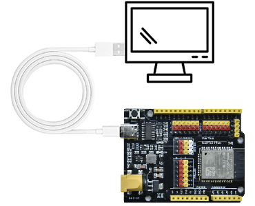
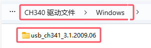
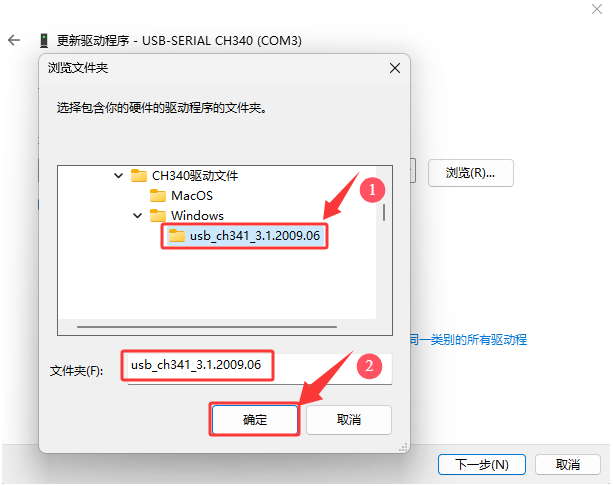
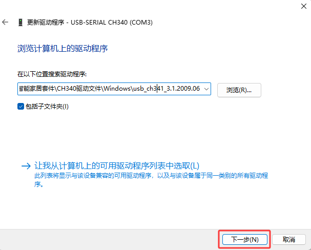

# 4. CH340驱动安装

## 4.1 驱动下载

点击下载CH340驱动文件：[CH340驱动文件](./CH340驱动文件.7z) 

## 4.2 驱动安装

将主板连接到电脑

### Windows 系统： 

（**注意：如果电脑已经安装了CH340驱动程序，则不需要再安装驱动；如果没有，则需要进行以下操作**）

将主控板用USB线连接在电脑上，一般MacOS和Windows10系统的电脑会自动安装驱动。如果没能自动安装，则需要手动安装驱动。

（1）查看电脑是否自动安装好驱动：

点击“计算机”--“属性”--“设备管理器”，显示如下图是安装成功的了：

（2）如果没能自动安装，那就手动安装，步骤如下：

右键点击“USB Serial”，选择“更新驱动程序(P)”并点击。

跳转到以下页面，选择“浏览我的电脑以查找驱动程序(R)”并点击。

点击“浏览(R)...”选择我们提供的资料中的驱动文件夹 “usb_ch341_3.1.2009.06” ，如下图。

单击 “关闭”。

再次查看串口连接状态，如下图，则是成功安装驱动

### MacOS 系统：

（**注意：如果电脑已经安装了CH340驱动程序，则不需要再安装驱动；如果没有，则需要进行以下操作**）

将主控板用USB线连接在电脑上，一般MacOS和Windows10系统的电脑会自动安装驱动。如果没能自动安装，则需要手动安装驱动。

(1)点击V1.5 CH340 MaxOS驱动程序包（对应的文件夹中已经提供有）

（2）单击安装包并点击“继续”。

（3）点击“安装”。

（4）输入用户密码，然后单击“安装软件”。

（5）点击“继续安装”。

（6）等待安装。

（7）安装完成后，单击“重新启动”。

