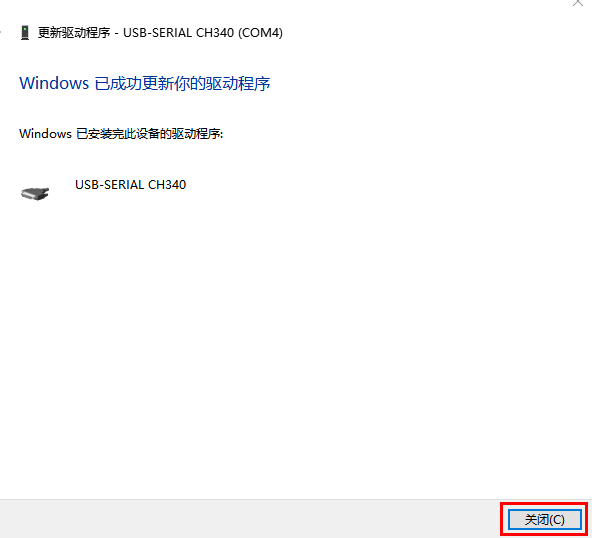
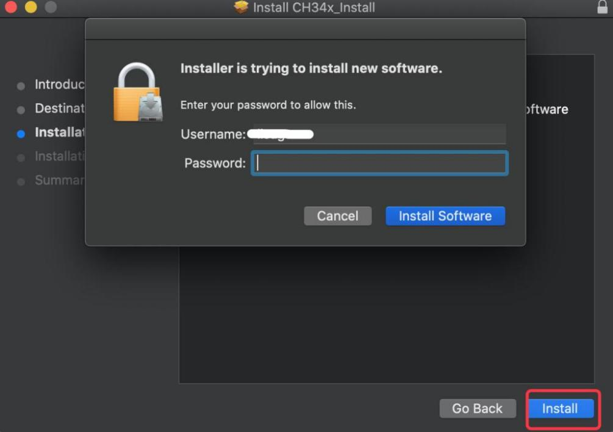

.. _4-ch340驱动安装:

4. CH340驱动安装
================

.. _41-驱动下载:

4.1 驱动下载
------------

点击下载CH340驱动文件：\ :download:`CH340驱动文件 <./CH340驱动文件.7z>`

.. _42-驱动安装:

4.2 驱动安装
------------

将主板连接到电脑

|Img|

Windows 系统：
~~~~~~~~~~~~~~

（\ **注意：如果电脑已经安装了CH340驱动程序，则不需要再安装驱动；如果没有，则需要进行以下操作**\ ）

将主控板用USB线连接在电脑上，一般MacOS和Windows10系统的电脑会自动安装驱动。如果没能自动安装，则需要手动安装驱动。

（1）查看电脑是否自动安装好驱动：

点击“计算机”--“属性”--“设备管理器”，显示如下图是安装成功的了：

|image1|

（2）如果没能自动安装，那就手动安装，步骤如下：

右键点击“USB Serial”，选择“更新驱动程序(P)”并点击。

|image2|

跳转到以下页面，选择“浏览我的电脑以查找驱动程序(R)”并点击。

|image3|

点击“浏览(R)...”选择我们提供的资料中的驱动文件夹 “usb_ch341_3.1.2009.06”
，如下图。

|image4|

|image5|

|image6|

|image7|

单击 “关闭”。

|image8|

再次查看串口连接状态，如下图，则是成功安装驱动

|image9|

MacOS 系统：
~~~~~~~~~~~~

（\ **注意：如果电脑已经安装了CH340驱动程序，则不需要再安装驱动；如果没有，则需要进行以下操作**\ ）

将主控板用USB线连接在电脑上，一般MacOS和Windows10系统的电脑会自动安装驱动。如果没能自动安装，则需要手动安装驱动。

(1)点击V1.5 CH340 MaxOS驱动程序包（对应的文件夹中已经提供有）

|image10|

|image11|

（2）单击安装包并点击“继续”。

|image12|

（3）点击“安装”。

|image13|

（4）输入用户密码，然后单击“安装软件”。

|image14|

（5）点击“继续安装”。

|image15|

（6）等待安装。

|image16|

（7）安装完成后，单击“重新启动”。

|image17|

.. |Img| image:: ./media/img-20250617134327.png

.. |image2| image:: media/device-manager1.png
.. |image3| image:: media/device-manager2.png
.. |image4| image:: ./media/device-manager3.png

.. |image6| image:: ./media/img-20250617113103.png
.. |image7| image:: ./media/img-20250617113206.png

.. |image11| image:: media/arduino-ide24.jpg
.. |image12| image:: media/arduino-ide25.jpg
.. |image13| image:: media/arduino-ide26.jpg

.. |image15| image:: media/arduino-ide28.jpg
.. |image16| image:: media/arduino-ide29.jpg
.. |image17| image:: media/arduino-ide30.jpg
