.. _5-esp32智能家居组装步骤:

5. ESP32智能家居组装步骤
========================

注意：这个套件的亚克力板使用时需要先撕去上面的保护膜。

|image1|

**安装1**

安装所需零件

|image2|

安装

|image3|

完成

|image4|

**安装2**

安装所需零件

|image5|

安装

|image6|

完成

|image7|

**安装3**

安装所需零件

|image8|

安装（注意电池盒线材朝下安装）

|image9|

完成

|image10|

**安装4**

安装所需零件

|image11|

安装

|image12|

完成

|image13|

**安装5**

安装所需零件

|image14|

安装

|image15|

完成

|image16|

**安装6**

安装所需零件

|image17|

安装（注意自锁螺母不可拧紧）

|image18|

完成

|image19|

**安装7**

安装所需零件

|image20|

\ **安装前需要调节舵机角度，我们需要将窗户的舵机调整到0度再安装**\ 

====== ====
舵机   主板
====== ====
棕线   G
红线   V
橙黄线 IO5
====== ====

|Img|

请先下载调节窗户上舵机角度的代码：\ :download:`窗户上的舵机初始化角度_代码 <./窗户上的舵机初始化角度_代码.7z>` ，保存至您方便使用的路径下。

|image21|

**方法一：Arduino 代码**

\ **⚠️特别提示:** 在编写代码并上传之前，必须安装Arduino
IDE，请进入链接：\ `Arduino
IDE开发环境设置 <https://www.keyesrobot.cn/projects/KE3050/zh-cn/latest/docs/Arduino%20%E6%95%99%E7%A8%8B/Arduino%20%E6%95%99%E7%A8%8B.html#arduino-ide>`__

.. code:: c++

   /*
    * 文件名 : window_servo
    * 功能   : 初始化窗户舵机的角度为0°
    * 编译IDE：ARDUINO IDE
    * 作者   : https://www.keyesrobot.cn/
   */

   const int ServoPin = 5; // 定义舵机连接的引脚

   void ServoControl(int servoAngle) {
       double thisAngle = map(servoAngle, 0, 180, 500, 2500); // 等比例角度值范围转换高电平持续时间范围
       unsigned char i = 50; // 50Hz 每秒的周期次数（周期/秒）即1S 50 个周期，每个周期20ms
       while (i--) {
           digitalWrite(ServoPin, HIGH); // 舵机处于高电平状态
           delayMicroseconds(thisAngle); // 高电平时间
           digitalWrite(ServoPin, LOW);  // 舵机处于低电平状态
           delayMicroseconds(20000 - thisAngle); // 每个周期20ms减去高电平持续时间
       }
   }

   void setup() {
       pinMode(ServoPin, OUTPUT); // 设置ServoPin为输出模式
       digitalWrite(ServoPin, LOW); // 先保证拉低
       ServoControl(0); // 舵机角度为0°
       delay(1000);
       ServoControl(90); // 舵机角度为90°
       delay(1000);
       ServoControl(0); // 舵机角度为0°
       delay(1000);
   }

   void loop() {

   }

如何得到它？

资料提供了调整窗户舵机的代码，请打开并烧录到主板，如下图所示。在文件夹
**..\\窗户上的舵机初始化角度_代码**
，打开文件\ **window_servo.ino**\ 。或将上述测试代码复制粘贴到Arduino
IDE中。

|image22|

将上述测试代码上传至主板之后，未发现舵机转动，可以按下主板上的复位键。

**方法二：Python 代码**

\ **⚠️特别提示:** 在编写代码并上传之前，必须安装 Thonny
IDE，请进入链接：\ `Thonny
IDE开发环境设置 <https://www.keyesrobot.cn/projects/KE3050/zh-cn/latest/docs/Python%20%E6%95%99%E7%A8%8B/Python%20%E6%95%99%E7%A8%8B.html#thonny-ide>`__

.. code:: python

   # 作者 : www.keyes-robot.com

   from machine import Pin, PWM
   import time
   pwm = PWM(Pin(5))  
   pwm.freq(50)

   '''
   与角度对应的占空比 
   0°----2.5%----25
   45°----5%----51.2
   90°----7.5%----77
   135°----10%----102.4
   180°----12.5%----128
   '''
   angle_0 = 25
   angle_90 = 77
   angle_180 = 128

   pwm.duty(angle_0)
   time.sleep(1)
   pwm.duty(angle_90)
   time.sleep(1)
   pwm.duty(angle_0)
   time.sleep(1)

   # while True:

如何得到它？

资料提供了调整窗户舵机的代码，请打开并烧录到主板，如下图所示。在文件夹
**..\\窗户上的舵机初始化角度_代码**
，打开文件\ **window_servo.py**\ 。或将上述测试代码复制粘贴到Thonny
IDE中。

|image23|

单击\ |image24|\ 运行上述测试代码，未发现舵机转动，可以按下主板上的复位键。

**方法三：Mixly 代码**

\ **⚠️特别提示:** 在编写代码并上传之前，必须安装 Mixly
IDE，请进入链接：\ `Mixly
IDE开发环境设置 <https://www.keyesrobot.cn/projects/KE3050/zh-cn/latest/docs/Mixly%20%E6%95%99%E7%A8%8B/Mixly%20%E6%95%99%E7%A8%8B.html#mixly-ide>`__

|image25|

如何得到它？

资料提供了调整窗户舵机的代码，请打开并烧录到主板，如下图所示。在文件夹
**..\\窗户上的舵机初始化角度_代码** ，使用 Mixly IDE
打开文件\ **window_servo.mix**\ 。或在Mixly
IDE中直接拖动代码块编写上述测试代码。

|image26|

上传上述测试代码，未发现舵机转动，可以按下主板上的复位键。

**方法四：KidsBlock(Scratch) 代码**

\ **⚠️特别提示:** 在编写代码并上传之前，必须安装 KidsBlock
IDE，请进入链接：\ `KidsBlock
IDE开发环境设置 <https://www.keyesrobot.cn/projects/KE3050/zh-cn/latest/docs/Scratch%20%E6%95%99%E7%A8%8B/Scratch%20%E6%95%99%E7%A8%8B.html#kidsblock-ide>`__

|image27|

如何得到它？

资料提供了调整窗户舵机的代码，请打开并烧录到主板，如下图所示。在文件夹
**..\\窗户上的舵机初始化角度_代码** ，使用 KidsBlock IDE
打开文件\ **window_servo.sb3**\ 。或在KidsBlock
IDE中直接拖动代码块编写上述测试代码。

|image28|

上传上述测试代码，未发现舵机转动，可以按下主板上的复位键。

安装（需按照下图姿态安装）

|image29|

若使用为M1.4*6MM自攻螺丝时，如下图

|image30|

完成

|image31|

**安装8**

安装所需零件

|image32|

安装

|image33|

完成

|image34|

**安装9**

安装所需零件

|image35|

安装

|image36|

完成

|image37|

**安装10**

安装所需零件

|image38|

安装

|image39|

完成

|image40|

**安装11**

安装所需零件

|image41|

安装

|image42|

完成

|image43|

**安装12**

安装所需零件

|image44|

安装

|image45|

完成

|image46|

**安装13**

安装所需零件

|image47|

安装

|image48|

完成

|image49|

**安装14**

安装所需零件

|image50|

安装

|image51|

完成

|image52|

**安装15**

安装所需零件

|image53|

安装

|image54|

完成

|image55|

**安装16**

安装所需零件

|image56|

安装

|image57|

完成

|image58|

**安装17**

安装所需零件

|image59|

安装

|image60|

完成

|image61|

**安装18**

安装所需零件

|image62|

安装

|image63|

完成

|image64|

**安装19**

安装所需零件

|image65|

安装

|image66|

完成

|image67|

**接线部分**

将温湿度模块接到io17接口

|image68|

|image69|

将黄色led模块接到io12接口

|image70|

|image71|

将水滴传感器接到io34接口

|image72|

|image73|

风扇模块接线(IN+对应io19，IN-对应io18）使用的杜邦线：4根散开的杜邦线

|image74|

|image75|

将人体红外传感器接到io14接口

|image76|

|image77|

将左边按键模块接到io16接口

|image78|

|image79|

将右边按键模块接到io27接口

|image80|

|image81|

将RFID模块接到IIC接口

|image82|

|image83|

将LCD1602显示屏接到IIC接口

|image84|

|image85|

将6812RGB灯接到io26接口

|image86|

|image87|

将气体传感器的白线接到io23接口，棕线不用接。

|image88|

|image89|

将蜂鸣器接到io25接口

|image90|

|image91|

将控制窗户的舵机接到io5接口

|image92|

|image93|

将控制门的舵机接到io13接口

|image94|

|image95|

电源接线

|image96|

**安装20**

安装所需零件

|image97|

安装

|image98|

完成

|image99|

安装所需零件

|image100|

安装

|image101|

完成

|image102|

.. |image1| image:: media/A00.png
.. |image2| image:: media/A1.png
.. |image3| image:: media/A1-1.jpg
.. |image4| image:: media/A1-2.jpg
.. |image5| image:: media/A2.png

.. |image8| image:: media/A3.png
.. |image9| image:: media/A3-1.jpg
.. |image10| image:: media/A3-2.jpg

.. |image12| image:: media/A4-1.png

.. |image15| image:: media/A5-1.png
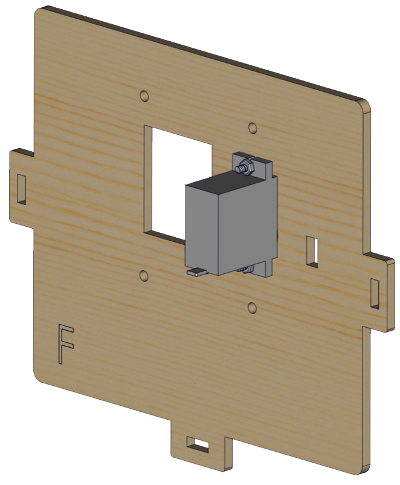
.. |image17| image:: media/A6.png

.. |image19| image:: media/A6-2.png
.. |image20| image:: media/99_1.png
.. |Img| image:: ./media/A7.png
.. |image21| image:: ./media/A7-1.png

.. |image23| image:: ./media/A7-3.png

.. |image25| image:: ./media/A7-4.png

.. |image27| image:: ./media/A7-6.png

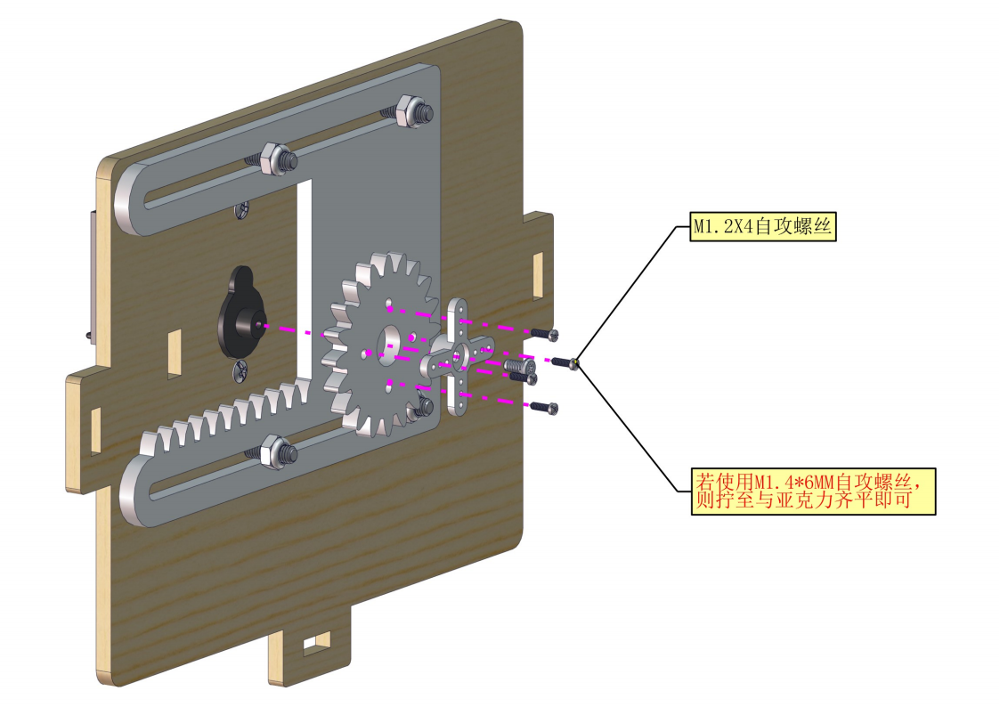
.. |image30| image:: media/100.png

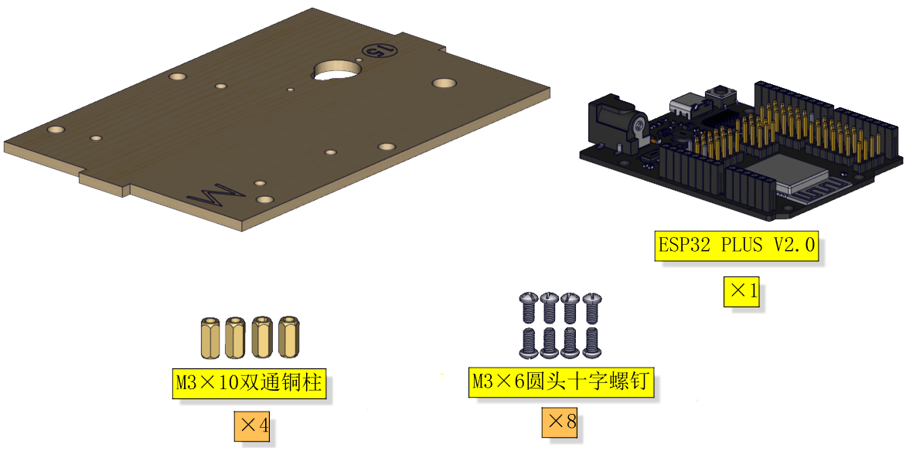
.. |image33| image:: media/A8-1.png
.. |image34| image:: media/A8-2.png
.. |image35| image:: media/A9.png
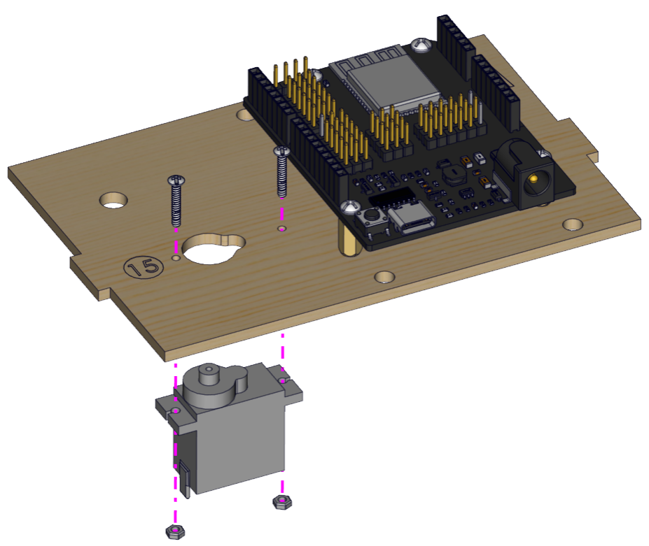
.. |image37| image:: media/A9-2.png
.. |image38| image:: media/A10.png

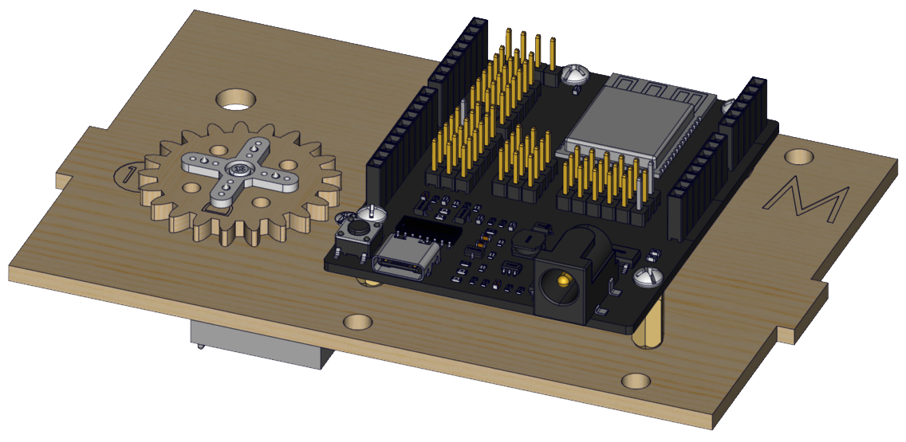

.. |image42| image:: media/A11-1.jpg
.. |image43| image:: media/A11-2.jpg
.. |image44| image:: media/A12.jpg

.. |image46| image:: media/A12-2.jpg

.. |image48| image:: media/A13-1.jpg

.. |image50| image:: media/A14.jpg
.. |image51| image:: media/A14-1.jpg
.. |image52| image:: media/A14-2.jpg
.. |image53| image:: media/A15.jpg

.. |image55| image:: media/A15-2.jpg

.. |image57| image:: media/A16-1.jpg

.. |image61| image:: media/A17-2.png
.. |image62| image:: media/A18.jpg
.. |image63| image:: media/A18-1.jpg

.. |image66| image:: media/A19-1.jpg

.. |image68| image:: media/A20.png
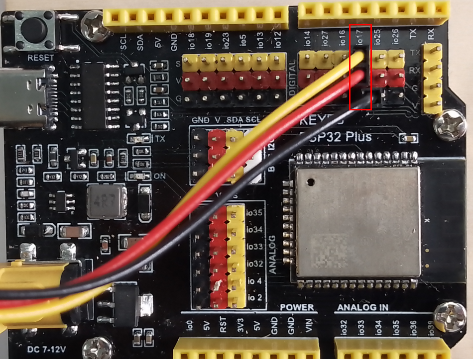
.. |image70| image:: media/A22.png
.. |image71| image:: media/A23.png
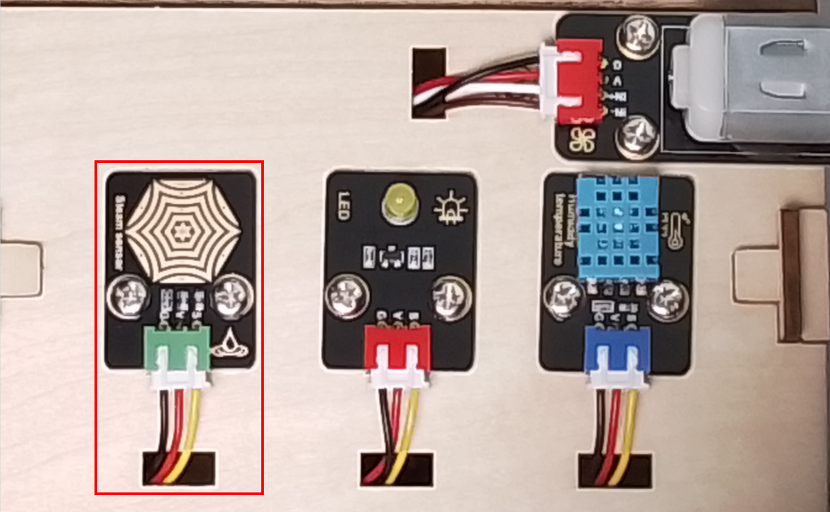
.. |image73| image:: ./media/A25.png
.. |image74| image:: media/A26.png
.. |image75| image:: ./media/A27.png
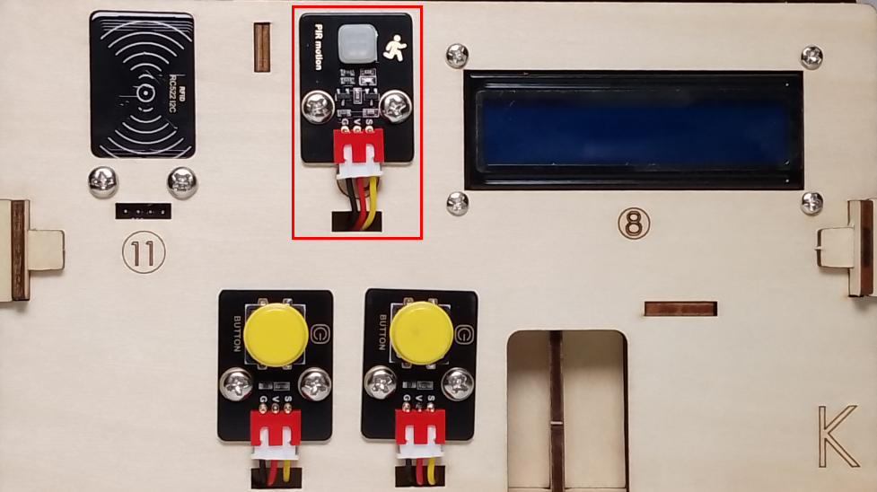
.. |image77| image:: ./media/A29.png
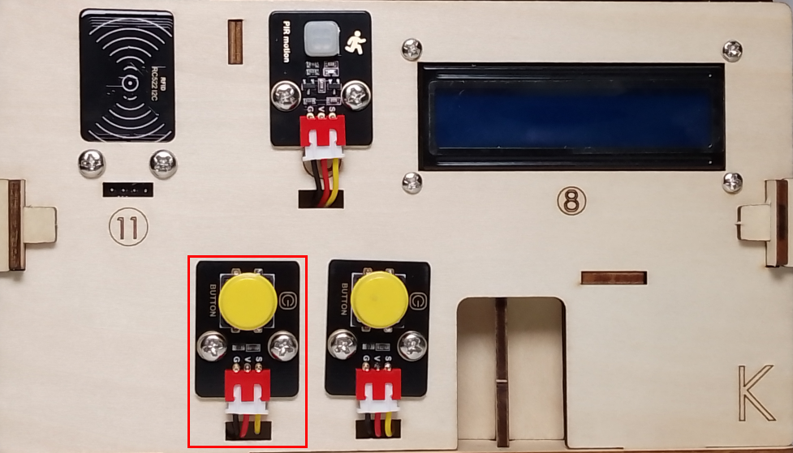
.. |image79| image:: ./media/A31.png
.. |image80| image:: media/A32.png
.. |image81| image:: ./media/A33.png

.. |image83| image:: media/A35.png
.. |image84| image:: media/A36.png
.. |image85| image:: ./media/A37.png
.. |image86| image:: media/A38.png

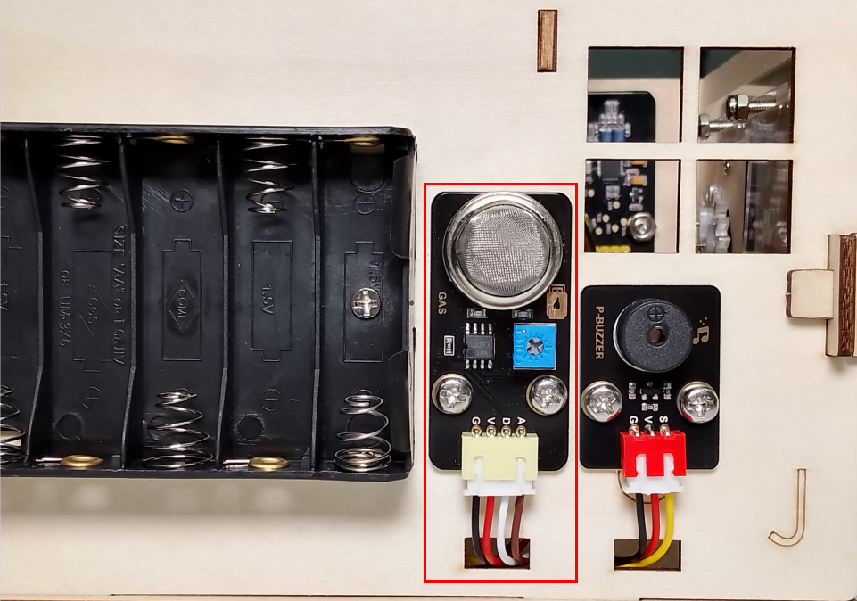
.. |image89| image:: ./media/A41.png
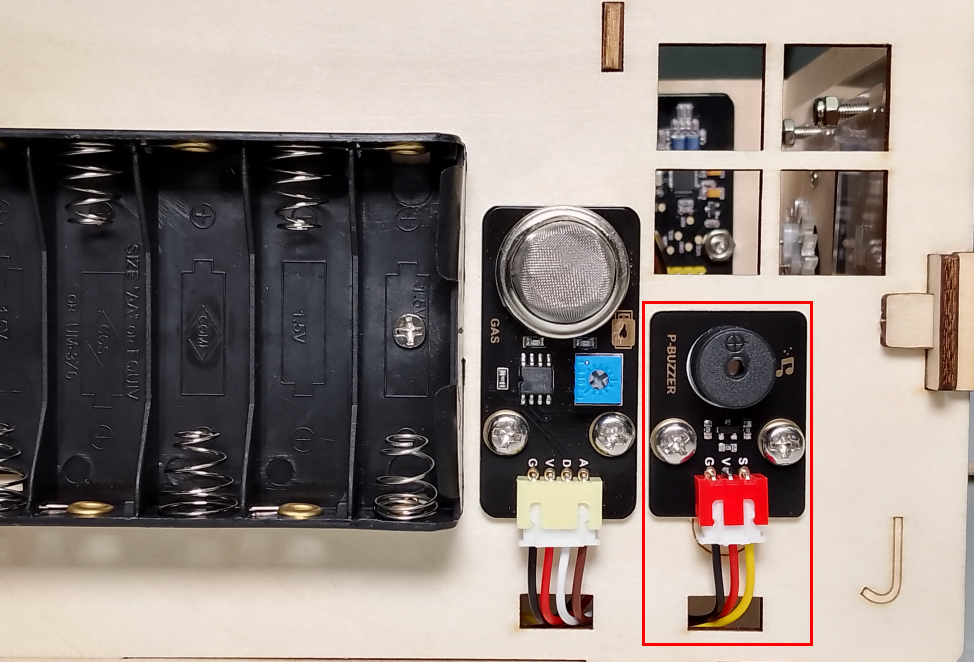

.. |image93| image:: ./media/A45.png
.. |image94| image:: media/A46.png
.. |image95| image:: ./media/A47.png

.. |image97| image:: media/A49.jpg

