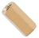
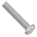

首先感谢选择keyes产品,

我们将继续为你提供好的产品和服务!

关于keyes

Keyes是KEYES Corporation旗下最畅销的品牌，我们的产品包括Arduino开发板、扩展板、传感器模块；树莓派、micro：bit扩展板和智能小车；以及为各阶段客户设计的完整入门套件。这些入门套件旨在为任何水平的客户学习Arduino、树莓派、micro：bit相关知识。

我们所有产品，均符合国际质量标准，在世界各地不同市场中，得到了极大的赞赏。

欢迎从我们的官方网站查看更多内容：

[http://www.keyes-robot.com](http://www.keyestudio.com)

获取资料和售后服务

1.  Keyes IOT ESP32智能家居套件的资料下载地址：

[https://pan.baidu.com/s/17Y519_rPwax1EO-5Q8bStw](https://pan.baidu.com/s/17Y519_rPwax1EO-5Q8bStw ) 
提取码：keye 

2.  如果发现某些东西丢失或损坏，或者学习套件时遇到一些困难。keyes会提供免费和快速的支持，如果您有任何疑问，请联系我们我们客服或工作人员。

3.  欢迎提出建议和反馈，我们会根据您的反馈不断更新套件和教程，以使其更好。谢谢！

产品安全

1.  本产品内含细小的零件（螺丝，铜柱等），请放在儿童接触不到的地方，防止划伤或误食。7岁及以下儿童使用，请在大人监督下使用。

2.  本产品包含导电部件(控制板和电子模块），请按照本教程的要求进行操作，不当的操作可能导致过热并且损害零件，请勿触摸并立即断开电路电源。

版权

keyes商标和徽标是KEYES DIY ROBOT co.,LTD的版权,任何人和公司在没有授权的情况下，不得复制，售卖，转卖，keyes品牌的产品。如果您有兴趣在当地售卖我们的产品，请联系我们专业的批发销售人员。

Keyes IOT ESP32智能家居套件

简介：

当下是物联网快速发展时代，各类智能设备逐渐融入到人们日常生活当中。例如：使用RFID实现刷卡开门；厨房装有气体检测报警器，检测到危险气体和大的烟雾就会发出警报声，提醒人们注意危险；检测到下雨了，能够自动收衣服和关上窗。各类电器设备都可以通过手机控制，控制灯、风扇、空调等。

因此，我们推出这款ESP32主控的智能家居产品，具有多样的传感器和模块，并且具备联网功能，能很好的助你学习物联网的相关知识。

# 产品特点

1. 结构外观好看
2. 丰富的传感器模块
3. 手机APP网络控制
4. 摩斯密码门
5. 自动关窗
6. RFID刷卡
7. 支持C语言编程，MicroPython语言编程，Mixly图形化编程和Scratch图形化编程

产品参数:

外接电源：DC（7-12V）

工作电压：DC（3.3V-5V）

工作电流：最大输出1.2A

工作最大功率：最大输出6W

工作温度范围：-10~50℃

清单：

当收到这个Keyes IOT ESP32智能家居套件的时候，首先看到是一个包装精美的外盒，每个配件被安全且有序的装在外盒里面的小袋子里，先来清点一下：

|序号|图片|规格|倍用量|
|-|-|-|-|
|1||ESP32智能家居用椴木板 七片 厚度3mm|1|
|2||ESP32智能家居用亚克力板 两片 无色透明|1|
|3||ESP32 PLUS开发板|1|
|4||SK6812 RGB模块|1|
|5||MQ-2模拟气体传感器|1|
|6||单路按键模块|2|
|7||RFID刷卡模块|1|
|8||无源蜂鸣器模块|1|
|9||130电机模块|1|
|10||水滴传感器|1|
|11||XHT11温湿度传感器（兼容DHT11）|1|
|12||人体红外热释传感器|1|
|13||黄色LED模块|1|
|14||舵机|2|
|15||I2C1602液晶屏模块|1|
|16||XH2.54-3Pin+杜邦母单 长19.5cm (红线在中间)|8|
|17||XH-2.54 4P 转杜邦线母单 26AWG 黑红白棕 200mm|3|
|18||高温硅胶杜邦线 4pin 黑红蓝绿母对母20cm 26AWG 连拼|1|
|19||M1.4*6MM 圆头 十字 自攻螺钉|10|
|20||M3 镀镍 自锁|5|
|21||M4*8MM 圆头 十字|24|
|22||M3*6MM 圆头 十字|9|
|23||M3*10MM 圆头 十字|5|
|24||M2*12MM 圆头 十字|5|
|25||M4 镀镍|24|
|26||M3 镀镍|7|
|27||M2 镀镍|6|
|28||M3*8MM 平头 十字|3|
|29||十字扳手 M2、M3、M4螺母|1|
|30||3.0*40MM 红黑色 十字螺丝刀 刀头加粗|1|
|31||2.0*40MM 紫黑色 十字螺丝刀|1|
|32||M3*10MM 双通|4|
|33||USB线|1|
|34||6节5号带线15CM露线 带DC插杆|1|
|35||M3*12MM 圆头 十字 螺钉|4|
|36||Ic卡 白卡85.5*54*0.80MM|1|
|37||钥匙扣TAG-03 41*33*403mm ABS蓝色|1|
|38||三叶软桨|1|

在线视频：
[https://www.bilibili.com/video/BV1Tx4y1t78m/](https://www.bilibili.com/video/BV1Tx4y1t78m/)
[https://www.bilibili.com/video/BV124421S7Dg/](https://www.bilibili.com/video/BV124421S7Dg/)

