套装清单：
==========

当收到这个Keyes IOT
ESP32智能家居套件的时候，首先看到是一个包装精美的外盒，每个配件被安全且有序的装在外盒里面的小袋子里，先来清点一下：

==== ========= ================================================= ======
序号 图片      规格                                              倍用量
==== ========= ================================================= ======
1    |image1|  ESP32智能家居用椴木板 七片 厚度3mm                1
2    |image2|  ESP32智能家居用亚克力板 两片 无色透明             1
3    |image3|  ESP32 PLUS开发板                                  1
4    |image4|  SK6812 RGB模块                                    1
5    |image5|  MQ-2模拟气体传感器                                1
6    |image6|  单路按键模块                                      2
7    |image7|  RFID刷卡模块                                      1
8    |image8|  无源蜂鸣器模块                                    1
9    |image9|  130电机模块                                       1
10   |image10| 水滴传感器                                        1
11   |image11| XHT11温湿度传感器（兼容DHT11）                    1
12   |image12| 人体红外热释传感器                                1
13   |image13| 黄色LED模块                                       1
14   |image14| 舵机                                              2
15   |image15| I2C1602液晶屏模块                                 1
16   |image16| XH2.54-3Pin+杜邦母单 长19.5cm (红线在中间)        8
17   |image17| XH-2.54 4P 转杜邦线母单 26AWG 黑红白棕 200mm      3
18   |image18| 高温硅胶杜邦线 4pin 黑红蓝绿母对母20cm 26AWG 连拼 1
19   |image19| M1.4*6MM 圆头 十字 自攻螺钉                       10
20   |image20| M3 镀镍 自锁                                      5
21   |image21| M4*8MM 圆头 十字                                  24
22   |image22| M3*6MM 圆头 十字                                  9
23   |image23| M3*10MM 圆头 十字                                 5
24   |image24| M2*12MM 圆头 十字                                 5
25   |image25| M4 镀镍                                           24
26   |image26| M3 镀镍                                           7
27   |image27| M2 镀镍                                           6
28   |image28| M3*8MM 平头 十字                                  3
29   |image29| 十字扳手 M2、M3、M4螺母                           1
30   |image30| 3.0*40MM 红黑色 十字螺丝刀 刀头加粗               1
31   |image31| 2.0*40MM 紫黑色 十字螺丝刀                        1
32   |image32| M3*10MM 双通                                      4
33   |image33| USB线                                             1
34   |image34| 6节5号带线15CM露线 带DC插杆                       1
35   |image35| M3*12MM 圆头 十字 螺钉                            4
36   |image36| Ic卡 白卡85.5\ *54*\ 0.80MM                       1
37   |image37| 钥匙扣TAG-03 41\ *33*\ 403mm ABS蓝色              1
38   |image38| 三叶软桨                                          1
==== ========= ================================================= ======

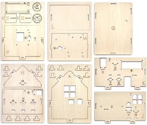
.. |image2| image:: media/02450e07c996853fbad4d180a4bb9c02.jpeg
.. |image3| image:: media/db0239ad87202a5a7d5194c5631d07d6.jpeg
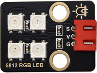
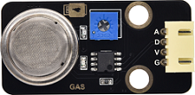
.. |image6| image:: media/4e57aa302e31fdd3bd6e1233cf4d6e88.png
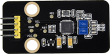
.. |image8| image:: media/aa2dc52cf306b6a272f74eaa50d612a3.png
.. |image9| image:: media/dccd9346e1e4863cdbaf64ddb957379a.png
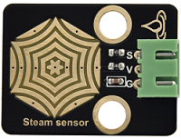
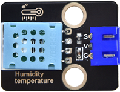
.. |image12| image:: media/239131563f68fbf379e97d8384cf2d9b.png
.. |image13| image:: media/539cdc7373aa76311c420b60818e33b3.png
.. |image14| image:: media/c79fddd8b3087d769353158024c4ad3d.png
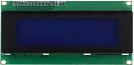
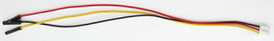
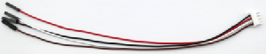
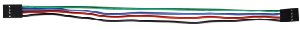
.. |image19| image:: media/c690465863f69298b19827cde5128f79.png
.. |image20| image:: media/0f61ce9e2292fa53d139281fc71092bf.png
.. |image21| image:: media/633c03364383bf7f7eeca4d74a4eaada.png
.. |image22| image:: media/d78ccac9728d58903e3561704acbe6dc.png
.. |image23| image:: media/623cdfd90b07f470c17d0c5998bd46af.png
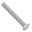
.. |image25| image:: media/7ee440258b612c64f900de1f0f8a710d.png
.. |image26| image:: media/a0b10f6e28fb19934e1fa34180ba9c4c.png

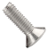
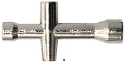
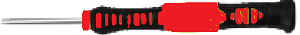
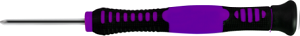
.. |image32| image:: media/aff257d4c8f9d1bee8dbacc9b8aca0f0.png
.. |image33| image:: media/50618f1d7d84d46dc4733e1df96f2c74.png
.. |image34| image:: media/8ef88abb35e6b91d4a801552576eba6d.png
.. |image35| image:: media/9dc3f434f4f5ddc84c01f956b1e75527.png

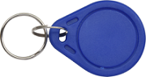
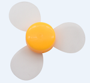
